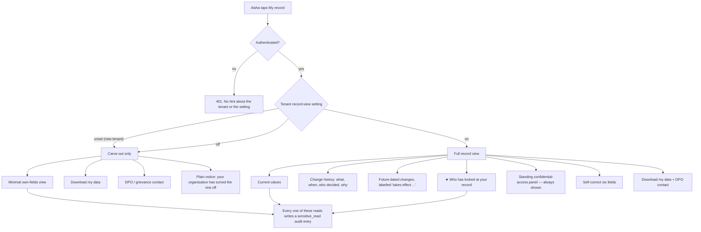

# Requirements — Employee self-service record view and history

## What is already decided, and is not reopened here

Three decisions were taken before these requirements were written. They are in
`99-decision-log.md`. They are implemented below, not re-argued.

1. **The record view is one organisation-level setting, OFF by default.** Off means the server
   returns 403. Not a hidden nav item, not a greyed button. When the setting has never been
   written, the answer is OFF — fail closed. HR of that person keeps access either way, and that
   **moves no row** in the `docs/07-fairness-and-transparency.md` Part 2 matrix.
2. **The right of access is carved out of that switch.** Download my data (`COMP-21`), a minimal
   own-fields view, and the published DPO / grievance contact (`COMP-06`) work whatever the
   setting says. The switch governs the *experience*. It never governs the statutory right.
3. **Future-dated changes stay visible.** Shown immediately, labelled with when they take effect.
   No hiding, no delay window, no per-change suppression.

## What actually exists to build on — verified against the code, 2026-08-26

I read `packages/core/src` and `packages/db/migrations/0001_core_hr_foundation.sql`. These
requirements are written against what is there, not against what feature 001 specified.

| Exists | Where | What it means for this feature |
|---|---|---|
| Bitemporal `employment_version` — `valid_from`/`valid_to` business time, `recorded_at`/`superseded_at` system time | migration L199–L235 | Current values and history are both answerable. `POINT_IN_TIME_PREDICATE` is the only correct way to ask "what is true today" |
| `transparency_ledger` with `what`, `decided_by`, **`decided_by_name` denormalised**, `reason NOT NULL`, `effective_from`, `reciprocal` | migration L287–L306 | This is the change history Aisha reads. The denormalised name is why a departed decider still has a name |
| `audit_log` with `actor_id`, `action`, `resource_type`, `resource_id`, `at`, `sensitive_read` | migration L268–L282 | This is the raw material for the access log. **It has no `purpose` column and no actor name.** See RULE-004 and REQ-020 |
| `legal_hold` table, real, with `scope` and `released_at` | migration L316–L329 | REQ-017 depends on it |
| `FORCE ROW LEVEL SECURITY` on all 11 tenant-scoped tables; `tenant` itself is RLS'd | migration L367–L386 | Tenancy is handled. Authorisation is not the same thing |
| `decide()` / `authorise()` with roles `employee \| manager \| hr_admin \| it_admin` | `policy.ts` | Every action in the permissions matrix below maps to this, or needs a new action name |
| `erasePerson` orchestrator with per-store assertions | `erasure.ts` | Anything this feature adds must register here (REQ-023) |

| Does **not** exist | Consequence for this feature |
|---|---|
| `apps/web`, any HTTP endpoint, any UI | Everything here is new transport. The `app.tenant_id` GUC risk from 001 becomes reachable on day one — see Handoff |
| Any tenant settings table or feature-flag store | REQ-001 needs one. Data specification below |
| Any read-path audit write. `writeAudit()` is called only from `applyEmploymentChange` and `erasePerson` | REQ-014 is new work, not wiring |
| `purpose` on an audit entry | RULE-004 derives it. Where it cannot be derived, REQ-005 says exactly what Aisha is told |
| Any actor **name** on an audit entry | REQ-020. The ledger solved this with `decided_by_name`; the audit log did not |
| `emergency_contact` and `profile_photo` in `SELF_CORRECTABLE` | The constant in `employment.ts` lists **four** fields. The columns `person.emergency_contact` and `person.profile_photo_url` exist. RULE-003 sets the list at six |
| Any function that enforces `SELF_CORRECTABLE` | Open MINOR from 001. REQ-009 closes it |
| Any notification queue | REQ-015's notice is the only notification in this slice, and it must degrade safely (`REL-04`) |
| Any login, session, or post-exit access path | REQ-022. The 90-day post-exit window is now **in scope** (Q-09 resolved, 2026-08-26). It is a time-boxed exception to exit revocation, not a change to it |

## Scope

**In.** One authenticated employee reading their own record. Current values · full change history
with reason and decider · future-dated changes labelled · who has looked at the record, human and
system reads separated · the standing confidential-access panel · self-correction of six
allowlisted fields, enforced server-side · Download my data · the DPO / grievance contact · the
tenant setting, its flip log and its employee notice · a `sensitive_read` audit entry on every read
path, whether the setting is on or off · **the 90-day post-exit sign-in window reaching the
carve-out screen only** · the events.

**Out, deliberately.** Directory and org chart · any HR-facing screen · correction *requests* for
locked fields · **the durable tracked request route for ex-employees — unauthenticated,
identity-verified, with the `COMP-24` clock (feature 003; until it ships the durable route is the
published DPO inbox, which `COMP-20` explicitly rules out — accepted debt, owner PM, review
2026-11-30)** · change notifications beyond REQ-015's setting notice · document vault · manager
view of a team · erasure request and consent withdrawal in-product · bulk import · native mobile
app · **any AI** (recorded deliberately, not by omission: `COMP-70`–`COMP-79` and `AI-*` do not
apply to this feature — no model call is made anywhere in it).

**Out of my lane and not decided here.** Which table holds the setting, how the endpoint is routed,
whether the access log is a view or a query. Those are `30-design-notes.md`.

---

## Process flow — current, then new

### Today

Aisha has no way in. Every path is a human.

```
Aisha notices something is wrong  ──▶  messages Meera (HRBP)  ──▶  Meera opens a ticket
        │                                                                  │
        │ no confirmation                                                  ▼
        └──────────────────────────────────────────────  Meera edits the record (or forgets)
                                                                           │
                                            Aisha finds out when payroll pays her, or never
```

Nobody outside HR knows a record was read. The `audit_log` rows exist and are shown to no one.

### New

Two entry points, and which one Aisha lands on depends on one setting.



**Decision points, and who acts.**

| # | Decision point | Who acts | Where it is specified |
|---|---|---|---|
| 1 | Turn the record view on or off for the organisation | **Priya (CHRO)**, through an account with `hr_admin` | REQ-015 |
| 2 | Is this request allowed at all? | Server, per request, never a cached claim | REQ-001, REQ-016 |
| 3 | Is this audit entry a human read or a system read? | Server, from the recorded actor kind | RULE-005 |
| 4 | Does this audit entry have a derivable purpose? | Server, from a closed lookup | RULE-004 |
| 5 | Is this audit entry a confidential-case read? | Server, suppression rule | RULE-010 |
| 6 | Is this field one Aisha may correct? | Server, allowlist function | REQ-009, RULE-003 |
| 7 | A reason names a third party — correct it | **Meera (HRBP)** or the DPO, by appending | REQ-021 |

### The people who are not users of this feature but are affected

- **Meera (HRBP).** Her name and her reads appear on Aisha's screen. She should meet her own
  access log before Aisha does — the PM put that in the launch plan and it stays there.
- **Rohan (Aisha's manager).** His `reason` text, written for the ledger, is now read verbatim by
  the person it is about. It always was going to be; now it visibly is. See the microcopy for the
  reason field, which is feature 001's, unchanged, and REQ-022 for when a reason names someone else.
- **Sunil (HR Ops).** A payroll job that reads Aisha's record appears in her access log as a system
  read. If his batch reads every record nightly, every employee sees a nightly line. RULE-006
  collapses those, and REQ-006 puts them in their own section, collapsed.
- **The DPO / grievance handler.** REQ-013 publishes their contact, and REQ-005's "Ask about this"
  route lands on them. They inherit whatever volume the access log generates. The PM's distress
  counter-metric is measured here.
- **A case handler under `docs/05-compliance-catalog.md` §3 Cases/POSH.** Their reads must not be
  visible, and the *absence* must not be visible either. RULE-010 and REQ-007.

---

## User stories with acceptance criteria

Every criterion below is meant to be a passing or failing test. Where a criterion says "within 2
seconds", the test asserts 2 seconds.

### REQ-001 — The organisation setting gates the record view, on the server

**As** Priya (CHRO)
**I want** the record view to be off until my organisation decides otherwise
**So that** we choose deliberately what we show our people, and nobody can walk around the choice

```
GIVEN tenant "Northwind" has never written the record-view setting
  AND Aisha is authenticated in Northwind
 WHEN she calls GET /api/me/record
 THEN the response is 403
  AND the body is {"code":"RECORD_VIEW_DISABLED"} with no employee data of any kind
  AND no employment, ledger or audit content appears in the response or its headers
      (fail closed — unset is OFF, SEC-01)

GIVEN the setting for Northwind is OFF
 WHEN Aisha calls GET /api/me/record, GET /api/me/history, or GET /api/me/access-log
 THEN each returns 403 with code RECORD_VIEW_DISABLED
  AND a record_view_blocked_by_tenant_setting event is emitted (OBS-03)

GIVEN the setting for Northwind is OFF
 WHEN Aisha opens the app
 THEN the "My record" navigation item is still present and still tappable
  AND tapping it opens the carve-out screen of REQ-012, never a dead link
      (a hidden nav item is a UI-only restriction, and REQ-009's rule applies
       here too: hiding a control is not a permission)

GIVEN the setting for Northwind is ON
 WHEN Aisha calls GET /api/me/record
 THEN 200, with her own record only

GIVEN the setting for Northwind is ON
  AND Aisha supplies an employment id belonging to Rohan
 THEN 404 with an empty body — never 403, which would confirm the record exists
      (REQ-001 of feature 001, SEC-02)
```

NFRs: `SEC-01`, `SEC-02`, `OBS-03`, `UX-02`.
Non-goals: per-field, per-department or per-employee granularity. One switch (decision log,
2026-08-26).

---

### REQ-002 — Aisha opens her record and sees what the company currently holds

**As** Aisha
**I want** to open one screen and see what my employer holds about me right now
**So that** I can tell whether my transfer is in the system and whether my phone number is right

```
GIVEN the setting is ON and Aisha is authenticated
 WHEN she opens My record
 THEN she sees, as of today's business date resolved against her work calendar:
      legal name, preferred name, pronouns, employee number, work email,
      personal email, personal phone, emergency contact, profile photo,
      date of birth, job title, team, manager, secondary manager if any,
      employment type, work location, hire date, and exit date if set
  AND date of birth is shown in full to her, and national ID is shown masked
      (last 4 characters only) with the line of RULE-012
  AND every date is locale-formatted, never ISO (I18N-02, RULE-009)
  AND the screen is interactive in under 2.0s on a mid-range Android over 4G,
      p95 server response under 800ms (PERF-01)
  AND the whole screen is operable by keyboard alone (A11Y-02)
  AND an own_record_viewed event is emitted (OBS-03)
  AND a sensitive_read audit entry is written (REQ-014, COMP-53)

GIVEN Aisha has a change effective 2026-09-01 and today is 2026-08-26
 WHEN she opens My record
 THEN the CURRENT values are the values valid on 2026-08-26
  AND the future change is shown separately, per REQ-004 — it is never mixed
      into the current values, because a value that is not yet true must not
      look true

GIVEN Aisha's employment_version chain contains a superseded row
 WHEN the current values are resolved
 THEN exactly one row is used — the point-in-time predicate including
      superseded_at IS NULL and valid_from < valid_to (RULE-002 of feature 001)
  AND if more than one row would match, the request fails with 500 and an alert,
      rather than showing Aisha one of two possible truths (REL-09, OBS-04)
```

NFRs: `PERF-01`, `A11Y-02`, `A11Y-05`, `I18N-02`, `UX-05`, `OBS-03`, `COMP-20`, `COMP-53`, `SEC-03`.

---

### REQ-003 — Aisha reads every change ever made, with the reason and the decider

**As** Aisha
**I want** to see every change to my job, in order, with who decided it and why
**So that** nothing about my work life arrives as a surprise

```
GIVEN Rohan moved Aisha from Engineering to Payments on 2026-08-22, effective
      2026-09-01, with the reason "Moving to Payments to lead the settlements work"
 WHEN Aisha opens her change history
 THEN she sees one entry reading:
      what      "Changed team, effective 1 September 2026"
      when      "Recorded 22 August 2026, 14:32 IST"
      who       "Rohan Mehta"
      why       "Moving to Payments to lead the settlements work"
  AND the reason is rendered as text, never as HTML, and is escaped (SEC-07)
  AND a record_history_expanded event is emitted the first time she expands it

GIVEN the change history has entries
 THEN they are ordered newest first by the date the decision was recorded
  AND each entry states plainly whether it was made by another person or by
      Aisha herself (RULE-008)

GIVEN Rohan is no longer employed at Northwind and his person row was erased
 WHEN Aisha opens her change history
 THEN the entry still names a decider — "Former employee" if the name was
      pseudonymised on erasure, and the original name if it was not
  AND the entry is never blank and never says "Unknown" (COMP-22 vs COMP-53,
      resolved in feature 001 by denormalising decided_by_name)

GIVEN a change was recorded and then superseded by a correction on the same day
 THEN Aisha sees BOTH entries, in order, and the second says what was corrected
      (RULE-008, worked example there)

GIVEN Aisha has no change history at all
 THEN she sees the empty state string history.empty, not a blank panel (UX-02)
```

NFRs: `SEC-07`, `UX-02`, `UX-04`, `I18N-01`, `I18N-02`, `OBS-03`, `COMP-20`, `COMP-25`.
Charter: `docs/07-fairness-and-transparency.md` Part 2, the Transparency Ledger.

---

### REQ-004 — A change that has not happened yet is shown, and labelled

**As** Aisha
**I want** to see a change before it takes effect
**So that** I am not the last person to find out about my own job

```
GIVEN today is 2026-08-26
  AND a change to Aisha's team is effective 2026-09-01
 WHEN she opens My record
 THEN the change appears at the top of her history, above today's entries
  AND it carries the badge "Takes effect 1 September 2026"
  AND the badge is a text label, not a colour alone (A11Y-04)
  AND a future_dated_change_shown event is emitted

GIVEN an exit date of 2026-11-30 has been recorded for Aisha
 WHEN she opens My record
 THEN it is shown, labelled "Takes effect 30 November 2026", with no delay and
      no suppression (decision log, 2026-08-26 — this is the case that decided
      the rule; a company that has written an exit date has decided)

GIVEN a change effective 2026-09-01 was recorded and is later cancelled
 THEN the cancellation appears as its own entry; the original entry is not
      removed from the history (append-only, Part 2 of the charter)
```

NFRs: `A11Y-04`, `I18N-02`, `OBS-03`.
Non-goals: any per-change hiding switch, any delay window. Refused in the decision log.

---

### REQ-005 — ★ Aisha sees who has looked at her record

This is the wow moment. It is also the biggest employee-facing risk in the feature, so the
criteria are stricter than anywhere else.

**As** Aisha
**I want** to see which people opened my record, when, and why
**So that** I know my file is not being read behind my back

```
GIVEN Meera Nair opened Aisha's record on 2026-08-14 during the annual pay review
 WHEN Aisha opens "Who has looked at your record"
 THEN she sees:
      "Meera Nair, HR Business Partner — opened your record on 14 August 2026.
       Reason: annual pay review."
  AND the purpose text comes from the closed lookup in RULE-004, never free text
  AND an access_log_viewed event is emitted

GIVEN an entry exists whose action has no purpose mapping
 THEN the entry is STILL SHOWN, with the line "Reason not recorded" and the
      "Ask about this" link
  AND an access_log_purpose_missing event is emitted with the action name and
      no PII (PRIV-07, OBS-04)
  AND the entry is never hidden, because a log with silent exclusions is not
      a log

GIVEN Aisha herself opened her record 12 times on 2026-08-26
 THEN she sees ONE line: "You opened your own record on 26 August 2026"
  AND it is shown, not excluded (Q-01, answered below)

GIVEN Meera opened Aisha's record 3 times on 14 August 2026 for the same purpose
 THEN they are grouped into one line reading
      "Meera Nair, HR Business Partner — opened your record 3 times on
       14 August 2026. Reason: annual pay review." (RULE-006)

GIVEN there are no human reads in the window
 THEN the empty state reads access.empty, and the standing panel of REQ-007 is
      still shown (UX-02)

GIVEN Aisha taps "Ask about this" on any entry
 THEN she reaches the DPO / grievance contact of REQ-013, prefilled with nothing
      about the entry that she did not already see (UX-04 — a negative or
      worrying outcome always carries a next step)

GIVEN nowhere on any screen
 THEN there is no total-count badge of how many people viewed the record
      (product decision, 10-opportunity.md — a bare count reads as surveillance)
```

NFRs: `PERF-01`, `A11Y-02`, `A11Y-04`, `UX-02`, `UX-04`, `PRIV-07`, `OBS-03`, `OBS-04`,
`COMP-53`, `COMP-20`. Charter: Part 2, "Who has viewed their sensitive data" — the person ✅,
their manager ❌, skip-level ❌, HR ✅, everyone ❌.

---

### REQ-006 — A nightly job is not a person, and the screen says so

**As** Aisha
**I want** automated reads kept apart from people reading my file
**So that** a payroll batch does not look like someone watching me

```
GIVEN the August payroll job read Aisha's record on 2026-08-25
  AND Meera read it on 2026-08-14
 WHEN Aisha opens the access log
 THEN the human reads are in a section headed access.humans.heading, expanded
  AND the automated reads are in a separate section headed
      access.system.heading, COLLAPSED by default
  AND the automated section is never empty-hidden — if it has no entries it
      shows access.system.empty
  AND the automated entry reads "Payroll run — August 2026 cycle. Automatic,
      no person read your record."

GIVEN an audit entry has no actor because the actor was erased (REQ-020)
 THEN it is classified as a HUMAN read with an unnamed actor, never as a
      system read (RULE-005 — a NULL actor id must not silently become
      "it was only a computer")

GIVEN the payroll job read every employee's record nightly for 30 nights
 THEN Aisha sees at most one line per job per calendar day (RULE-006)
```

NFRs: `A11Y-04`, `UX-02`, `UX-06`, `OBS-03`.

---

### REQ-007 — The standing confidential-access panel, shown to everyone, always

**As** a person who has raised a grievance
**I want** the fact that my complaint exists to be invisible in someone else's access log
**So that** the person I complained about cannot deduce it

This is the requirement most likely to be got wrong, because the natural implementation — show a
notice when something is suppressed — is itself the leak.

```
GIVEN Aisha has no suppressed entries at all
 WHEN she opens the access log
 THEN the panel of RULE-010 is shown, in full, in the same position

GIVEN Rohan HAS a suppressed entry, because a case handler opened his record
 WHEN he opens the access log
 THEN the panel is shown, in full, in the same position, with the SAME text

GIVEN a test renders the access log for a person with suppressed entries and
      for a person with none
 THEN the rendered markup of the panel region is byte-identical between them
  AND no attribute, count, ordering, spacing or ARIA label differs
  AND no response header, event payload, timing characteristic or entry count
      differs in a way that reveals suppression (this is the assertion; if it
      cannot be made, the feature is not shippable)

GIVEN the panel is shown
 THEN it renders the four strings access.confidential_panel.heading, .body,
      .invariant and .action, resolved from the tenant's market with the
      default set as the fallback
  AND an unrecognised market resolves to the DEFAULT set, never to no panel
      (fail closed — an absent panel is the leak)

GIVEN the access log is rendered in any state
 THEN the panel sits immediately after the heading and window note, ABOVE the
      first entry, in the same DOM position every time
  AND it is present on first paint, not loaded after the entries
  AND its body is expanded, not collapsed behind a control

GIVEN a "Why is this here?" link exists
 WHEN it is opened
 THEN hidden_data_explainer_opened is emitted with an EMPTY payload — an
      interaction signal that differed by state would defeat the panel

GIVEN a tenant that has never had a case, so nothing is suppressed anywhere
 THEN the panel is STILL rendered, on every access log, from the first release
      (see the note below — introducing it later is itself the leak)

GIVEN an entry is suppressed
 THEN a suppression record exists with subject, actor scope, reason, owner and
      a review date, per RULE-014
  AND no entry is suppressed without one (fail closed the other way: an entry
      with purpose_code = case_handling and NO suppression record is a defect,
      and it is alerted, not silently hidden)
```

NFRs: `PRIV-08`, `SEC-01`, `A11Y-05`, `I18N-01`, `OBS-04`, `COMP-53`.
Compliance: `docs/05-compliance-catalog.md` §3 Cases/POSH — "complainant protection from
access-log exposure". Charter Part 2 — "ongoing investigations" is a legitimate limit, **and it
must be time-boxed, audited, with the scope recorded** (RULE-014), and the limit itself must be
visible.
**Q-02: the wording is now drafted and the build is unblocked. The strings are marked DRAFTED, NOT
LEGALLY APPROVED and need counsel sign-off, per market, before release.**

---

### REQ-008 — Aisha corrects her own phone number, with nobody's permission

**As** Aisha
**I want** to fix my own contact details in two taps
**So that** my payslip does not bounce and my emergency contact is not my ex-partner

```
GIVEN the setting is ON and Aisha's personal phone is "+91 98200 11111"
 WHEN she changes it to "+91 99300 22222" and saves
 THEN it is saved immediately, with no approval and no HR ticket (COMP-25)
  AND the whole action completes in under 10 seconds including her typing (PERF-02)
  AND an audit entry records before, after, actor and timestamp (SEC-05, COMP-25)
  AND a self_correction_saved{field:"personal_phone"} event is emitted — the
      field NAME only, never the value (PRIV-07)
  AND she sees the confirmation string selfcorrect.saved

GIVEN Aisha submits a personal email of "not-an-email"
 THEN 422 with a field-level error naming the field and what is wrong:
      selfcorrect.error.email
  AND nothing is written

GIVEN Aisha uploads a profile photo of 12 MB
 THEN 422 with selfcorrect.error.photo_too_big, stating the limit in the message
  AND the file is type-checked and size-limited before it is stored (SEC-08)

GIVEN Aisha clears her personal phone entirely
 THEN it is saved as empty — a person is allowed to remove their own optional
      contact details (PRIV-02, and the charter's dark-pattern rule: no
      "your manager will see that you declined" framing)

GIVEN the setting is OFF
 WHEN Aisha attempts any self-correction
 THEN 403 with code RECORD_VIEW_DISABLED, and the carve-out screen tells her
      who to contact instead (RULE-002 — self-correction is an experience, not
      a statutory right; correction *rights* are served through REQ-013's
      contact until feature 003 builds the request queue)
```

NFRs: `PERF-02`, `SEC-05`, `SEC-07`, `SEC-08`, `PRIV-02`, `PRIV-07`, `UX-04`, `COMP-25`.

---

### REQ-009 — The self-correctable allowlist is a function, not a list in a comment

This closes the open MINOR from feature 001: `SELF_CORRECTABLE` is an allowlist with no enforcing
function. An allowlist nothing calls is documentation.

**As** Dev (IT admin)
**I want** the field restriction enforced at the API
**So that** I can tell an auditor it is a permission and not a screen layout

```
GIVEN Aisha calls PATCH /api/me/details with {"job_title":"CEO"}
 THEN 403 with code FIELD_NOT_SELF_CORRECTABLE and the field name echoed
  AND NO row is written to person, employment or employment_version
  AND an audit entry records the refused attempt with actor and field name
  AND a self_correction_rejected{field:"job_title", reason:"not_allowlisted"}
      event is emitted

GIVEN Aisha calls PATCH /api/me/details with
      {"personal_phone":"+91 99300 22222","manager_employment_id":"<uuid>"}
 THEN 403, and the ALLOWED field is NOT saved either — a request containing a
      forbidden field is rejected whole, never partially applied
      (partial application is how a mixed payload becomes a privilege
       escalation, REL-09)

GIVEN Aisha calls PATCH /api/me/details with {"salary":900000}
      — a field that does not exist on any table this endpoint touches
 THEN 422 with code UNKNOWN_FIELD, and nothing is written

GIVEN Aisha calls PATCH /api/employees/<Rohan's id>/details with
      {"personal_phone":"..."}
 THEN 403 — person.self_correct is allowed for self only, and that is already
      what policy.ts decides. The endpoint must call it (SEC-01)

GIVEN the allowlist constant is changed to add a field
 THEN a test fails unless that field also has a data_classification row
      (COMP-34 — a new personal-data field cannot appear without a
       classification and a retention period)
```

**What "enforced server-side" means here, precisely.** Four things, and all four are testable:

1. The set of correctable fields is a single frozen constant in `packages/core`, and the endpoint
   imports it. There is not a second copy in the transport layer.
2. A function takes the incoming field names and returns allowed or refused. The endpoint calls it
   **before** any SQL is constructed. Nothing else decides.
3. A field name that came from the request body is never interpolated into SQL. The mapping from
   allowlisted field name to column is a fixed lookup in code (`SEC-07`, injection).
4. The check runs even when the request comes from an `hr_admin` account acting on themselves —
   HR correcting their own job title through this endpoint is refused the same way, because
   `policy.ts` already refuses self-change of job, team or reporting line and this endpoint must
   not become the way around it.

NFRs: `SEC-01`, `SEC-05`, `SEC-07`, `REL-09`, `COMP-34`, `OBS-03`.

---

### REQ-010 — Aisha edits from two devices at once

**As** Sunil (HR Ops)
**I want** a concurrent edit to fail loudly
**So that** I never have to explain why a bounced payslip went to a number nobody typed

This also answers feature 001's open **Q-06 to the BA** — what a 409 body must contain — for this
feature's endpoints.

```
GIVEN Aisha loads My record on her phone at 09:00:00, and on her laptop at 09:00:05
  AND both show personal_phone "+91 98200 11111"
 WHEN she saves "+91 99300 22222" on the phone at 09:01:00
  AND then saves "+91 97700 33333" on the laptop at 09:01:30
 THEN the phone save succeeds
  AND the laptop save returns 409 with a body containing:
        code            "STALE_RECORD"
        fields          ["personal_phone"]
        current_value   "+91 99300 22222"
        changed_at      "2026-08-26T09:01:00Z"
        changed_by      "You"
  AND the laptop shows selfcorrect.conflict, which names the field and the
      current value, and offers "Use this instead" and "Keep mine"
  AND nothing is silently overwritten (last-write-wins on a phone number is a
      bounced payslip, REL-09)

GIVEN Meera changes Aisha's legal name at the same moment Aisha changes her
      preferred name
 THEN both succeed — the conflict check is per field, not per row
```

NFRs: `REL-09`, `UX-02`, `UX-04`.

---

### REQ-011 — Download my data, whatever the setting says

**As** Aisha
**I want** a complete machine-readable copy of my data
**So that** I can exercise my right of access without emailing anybody

```
GIVEN the setting is OFF
 WHEN Aisha taps "Download my data"
 THEN she receives a JSON file within 30 seconds, or a message telling her it
      is being prepared and where it will appear
  AND a data_export_requested event is emitted — this event fires whether the
      setting is on or off, because it is the carve-out's evidence
  AND a sensitive_read audit entry is written

GIVEN the export runs
 THEN it contains, per RULE-012: person fields; every employment; every
      employment_version including superseded ones, with reason and decider;
      every transparency ledger entry about her; her access log for the window
      of RULE-007; her legal-hold status where REQ-017 permits; the tenant
      setting state and its history as it affected her; and the derived values
      tenure_days and total_tenure_days, each named separately
  AND it is valid JSON, parses without error, and states its schema version
  AND it contains no other person's personal data except the emergency contact
      Aisha herself supplied (RULE-012, trust edge)

GIVEN Aisha requests the export 6 times in one minute
 THEN the 6th is rate-limited with 429 and a plain message telling her when she
      can try again (SEC-10)
  AND an alert fires on repeated mass-export attempts (COMP-60)

GIVEN Aisha is under a legal hold
 THEN the export still runs — a hold blocks erasure, never access (REQ-017)
```

NFRs: `SEC-10`, `SCALE-02`, `PRIV-07`, `OBS-03`, `COMP-20`, `COMP-21`, `COMP-60`, `UX-04`.

---

### REQ-012 — What Aisha sees when her organisation has it switched off

**As** Aisha, in a default-configured tenant
**I want** to know what exists, what I can still do, and what has been turned off
**So that** I am not left guessing whether there is nothing to show or nothing shown to me

The PM recommended telling her, and flagged it as **Q-08, a values question**. I am specifying
**yes, tell her**, because the alternative fails the charter's own sentence: *"a visible 'this is
hidden, and here is why' is more trust-building than a screen that pretends nothing is missing."*
The wording is factual and does not editorialise about the employer.

```
GIVEN the setting is OFF and Aisha opens My record
 THEN she sees exactly three things, and nothing else:
      1. the minimal own-fields view of RULE-002
      2. "Download my data"
      3. the DPO / grievance contact of REQ-013
  AND above them, the notice string offstate.notice, which states plainly that
      the change history and the access log are turned off for her organisation
  AND the notice does NOT say who turned it off, does NOT name an individual,
      and does NOT invite her to lobby anyone
  AND a record_view_blocked_by_tenant_setting event is emitted

GIVEN the setting is OFF
 WHEN Aisha calls GET /api/me/history or GET /api/me/access-log directly
 THEN 403 RECORD_VIEW_DISABLED — the notice is a courtesy on the screen, the
      403 is the control (SEC-01)

GIVEN the setting has never been written for this tenant
 THEN the behaviour is identical to OFF in every respect, including the notice
```

NFRs: `SEC-01`, `UX-02`, `UX-04`, `UX-06`, `I18N-01`, `OBS-03`, `COMP-20`, `COMP-21`.
**Q-08 remains open as a values question for the human. I have specified the recommended
behaviour so it is buildable; if the human decides otherwise, only `offstate.notice` changes.**

---

### REQ-013 — The DPO and grievance contact is in the product

**As** Aisha
**I want** a named route to a human about my data
**So that** "contact us" is not a dead end

```
GIVEN the setting is OFF or ON
 WHEN Aisha opens the contact panel
 THEN she sees the tenant's configured data-protection contact name, email and
      a stated response clock, and the grievance route if it differs
  AND a dpo_contact_opened event is emitted, whether the setting is on or off

GIVEN the tenant has not configured a contact
 THEN she sees dpo.unconfigured, which names the fallback route, and an alert
      fires to operations — a blank contact panel is a compliance failure
      showing as a UI gap (COMP-06, OBS-04)
```

NFRs: `COMP-06`, `COMP-24`, `UX-04`, `OBS-04`.
`[LAW — VERIFY: whether a published contact and a stated clock satisfy the grievance-officer /
DPO publication requirement in each market — DPDP Act 2023 and DPDP Rules 2025 for India, GDPR
Arts. 13, 37–39 for the EU. Unverified, as of 2026-08-26.]`

---

### REQ-014 — Every read writes an audit entry, whether or not anyone may see it

**As** Sunil, at audit time
**I want** the audit to be complete regardless of the tenant setting
**So that** turning the screen back on does not produce a log with a hole in it

```
GIVEN the setting is OFF
 WHEN Aisha opens the minimal view or downloads her data
 THEN a sensitive_read audit entry is written, exactly as if the setting were ON
      (COMP-53 — the audit does not depend on who is allowed to read it)

GIVEN Meera reads Aisha's record through any path that exists
 THEN a sensitive_read audit entry is written with actor, action, resource,
      timestamp, and the actor identity fields of REQ-020
  AND the write happens in the same transaction as the read response is
      prepared, so a failed audit write means no data is returned
      (a partial access log is worse than none — the PM's guardrail)

GIVEN the audit write fails
 THEN the request returns 503 with retry.later, and an alert fires (OBS-04)
  AND no employee data is returned

GIVEN 10,000 employees each open their record twice a day
 THEN the audit write does not degrade the p95 of the read path beyond 800ms
      (PERF-01, COST-03 — audit volume is projected before this ships)
```

NFRs: `SEC-05`, `PERF-01`, `REL-04`, `OBS-04`, `COST-03`, `COMP-53`, `COMP-62`.

---

### REQ-015 — Turning it on, and turning it off, are both events people are told about

**As** Priya (CHRO)
**I want** my decision recorded and announced
**So that** the organisation is seen to have made a choice, in either direction

The PM recommended logging and notifying in **both** directions (Q-04). The charter only requires
it for the more-visible direction. I am specifying both, because an organisation that withdraws a
transparency surface silently is doing the exact thing the charter exists to prevent.

```
GIVEN the setting for Northwind is OFF
 WHEN Priya, holding hr_admin, switches it ON with the reason
      "We want people to see their own file"
 THEN the change is recorded with from, to, actor id, actor display name,
      timestamp and reason
  AND the reason is required and non-empty after trim — an empty reason is 422
      (same rule as every other decision about people, charter Part 2)
  AND a tenant_record_view_setting_changed{from:"off", to:"on", actor, reason}
      event is emitted (OBS-03; the reason text is NOT in the event payload —
      PRIV-07 — only that one was given)
  AND every current employee is notified with the string setting.turnedon.notice

 WHEN she later switches it OFF
 THEN the same recording happens with from:"on", to:"off"
  AND every current employee is notified with setting.turnedoff.notice, which
      states what has been withdrawn and the date

GIVEN the notification path is unavailable
 THEN the setting change still succeeds and the notice is queued, and an alert
      fires if it is still unsent after 24 hours (REL-04, OBS-04)
  AND the setting change is never silently un-notified

GIVEN Dev, holding it_admin only, attempts to change the setting
 THEN 403 — this is a statement about how the company treats people, and the
      permissions matrix puts it with hr_admin, not with the person who
      administers the tenant

GIVEN the setting is changed twice within one second by a double-tap
 THEN exactly one change is recorded and exactly one notice is sent (REL-03)

GIVEN the history of setting changes
 THEN it is append-only and readable by hr_admin, and the entries that affected
      Aisha appear in her export (RULE-012)
```

NFRs: `SEC-01`, `REL-03`, `REL-04`, `PRIV-07`, `OBS-03`, `OBS-04`, `UX-04`, `UX-06`.
Charter: Part 2, "an explicit, logged, in-product decision that employees are notified of".
Non-goals: a settings console. One control, wherever the admin surface is.

---

### REQ-016 — The setting flips while Aisha is looking at the screen

**As** Aisha
**I want** to be told what happened, rather than watching the page break
**So that** I do not think the app is broken or that I did something wrong

```
GIVEN Aisha has the full record view open, loaded at 11:00
  AND Priya switches the setting OFF at 11:02
 WHEN Aisha taps to expand her change history at 11:03
 THEN the request returns 403 RECORD_VIEW_DISABLED
  AND the screen replaces the record view with the carve-out screen of REQ-012
  AND she sees the string setting.changed_midsession, which says the record view
      was turned off while she was looking at it, and what she can still do
  AND a record_view_blocked_by_tenant_setting event is emitted
  AND the already-rendered content is cleared from the screen — it is not left
      visible behind a banner

GIVEN Aisha's session token was issued while the setting was ON
 WHEN she makes any gated request after the setting is turned OFF
 THEN it is refused — the setting is evaluated from the store on every request
      and is never read from a session claim, a cached flag, or a JWT
      (SEC-01; a cached permission is a permission with a stale answer)

GIVEN the setting is switched ON while Aisha is on the carve-out screen
 THEN her next request succeeds and the full view is available; she is not
      required to log out and in again
```

NFRs: `SEC-01`, `UX-02`, `UX-04`, `PERF-01` (the per-request setting read must not add more than
50ms to the p95), `OBS-03`.

---

### REQ-017 — A legal hold blocks erasure. It never blocks access.

**As** Aisha, whose record is under a litigation hold
**I want** my right to see and download my data to be unaffected
**So that** a hold placed for someone else's benefit does not quietly cost me mine

```
GIVEN an unreleased legal_hold row exists for Aisha
 WHEN she opens the record view or downloads her data
 THEN both work exactly as they would without the hold — no degradation, no
      delay, no reduced field set (COMP-23 concerns erasure, not access)

GIVEN the tenant's configuration says holds are disclosable in this market
 THEN Aisha sees the string hold.disclosed, which states that a hold exists,
      the date it was placed and the stated scope, and NOT the reason text and
      NOT who placed it (the reason routinely names other people — REQ-021)

GIVEN the tenant's configuration says holds are NOT disclosable in this market
 THEN nothing about the hold appears anywhere on the screen or in the export
  AND the absence is not detectable by comparing screens — the disclosure block
      is a configured tenant-wide behaviour, not a per-person conditional

GIVEN the disclosure configuration has never been set
 THEN holds are NOT disclosed — fail closed on disclosure, because telling
      someone about a hold they should not have been told about cannot be undone
```

NFRs: `SEC-01`, `PRIV-08`, `COMP-23`, `UX-06`.
`[LAW — VERIFY: whether the DPDP Act 2023 / DPDP Rules 2025 and GDPR Art. 15 permit, require, or
prohibit informing a data subject that a litigation hold exists, per market. Unverified, as of
2026-08-26. This is a per-market parameter, not a hard-coded behaviour — see the parameter table.]`

---

### REQ-018 — Aisha was rehired, and has two employments

**As** Aisha, who left in 2021 and came back in 2023
**I want** both periods shown, clearly separated
**So that** my tenure number means something

```
GIVEN Aisha has employment E1 (2019-06-01 to 2021-03-31, exited) and
      employment E2 (2023-04-01, active), both on one person row
 WHEN she opens My record
 THEN current values come from E2 only
  AND the history shows both periods, each headed with its own dates, newest
      first, with a visible break between them
  AND two numbers are shown and each is labelled:
        "Time in this job: 3 years 4 months"      (E2, from 2023-04-01)
        "Total time at Northwind: 5 years 1 month" (E1 + E2)
  AND neither number is called simply "tenure" (feature 001, Q-02 — the two get
      confused constantly and the UI must say which it is showing)

GIVEN the access log for Aisha
 THEN it covers reads of her PERSON record and reads of BOTH employments —
      a read of E1 is a read about Aisha (RULE-006)
  AND an entry from the E1 period is not silently dropped because the current
      employment is E2

GIVEN the export
 THEN it contains both employments and every version of each (RULE-012)
```

NFRs: `I18N-02`, `UX-06`, `COMP-20`, `COMP-21`.

---

### REQ-019 — 400 entries in the access log

**As** Aisha in a large organisation
**I want** the screen to stay usable
**So that** I can find the entry I care about without scrolling for a minute

```
GIVEN Aisha's access log holds 400 entries in the window
 WHEN she opens it
 THEN the first page shows 25 entries after grouping (RULE-006)
  AND the control to see more is labelled access.more and loads the next 25
  AND there is NO "1 of 16 pages", NO "400 entries" and NO total-count badge
      anywhere — the paging is cursor-based and the total is never computed
      or displayed (product decision, 10-opportunity.md)
  AND the first page is interactive in under 2.0s on a mid-range Android over
      4G (PERF-01)
  AND an access_log_scrolled_past_first_entry event is emitted once per session
      when she moves beyond the first entry

GIVEN Aisha loads 400 entries by pressing "Show more" repeatedly
 THEN keyboard focus lands on the first newly-loaded entry each time, and the
      new count is announced to a screen reader (A11Y-02, A11Y-05)

GIVEN a tenant with 50,000 employees each opening the access log
 THEN the query is bounded and indexed; no unbounded scan of audit_log (SCALE-02)
```

NFRs: `PERF-01`, `SCALE-02`, `A11Y-02`, `A11Y-05`, `UX-02`, `OBS-03`.

---

### REQ-020 — The person who looked has since left, or been erased

**As** Aisha
**I want** every entry to name someone or say plainly that it cannot
**So that** the log does not degrade into a list of blanks

This is the sharpest gap I found between the brief and the code. The transparency ledger solved
this with `decided_by_name`, denormalised on purpose. **`audit_log` has no equivalent**, its
`actor_id` is nullable with no foreign key, and `erasure.ts` sets `actor_id = NULL` when the
viewer is erased. Without a fix, an access log of a normal-sized company fills with unattributed
entries over time — and an unattributable entry is worse than no feature.

```
GIVEN Meera read Aisha's record on 2026-08-14
 THEN the audit entry captured, AT THE TIME OF THE READ, the viewer's display
      name and role label as they were then
  AND the access log renders from those captured values, never from a join
      resolved at display time

GIVEN Meera left Northwind on 2026-10-31 and her employment is exited
 WHEN Aisha opens the access log on 2026-11-05
 THEN the 14 August entry still reads "Meera Nair, HR Business Partner"
  AND her role label is the one she held on 14 August, not a later one

GIVEN Meera's person record is later erased under COMP-22
 THEN the captured name is pseudonymised to "Former employee" by the erasure
      orchestrator, using the same narrow column-grant pattern feature 001 used
      for transparency_ledger.decided_by_name
  AND the entry still shows its date and its purpose
  AND it reads "Former employee, HR Business Partner — opened your record on
      14 August 2026. Reason: annual pay review."

GIVEN an entry whose actor cannot be identified at all
 THEN it is shown as an unnamed HUMAN read with the string access.unknown_actor
      and the "Ask about this" route
  AND it is NEVER reclassified as a system read (RULE-005)
```

NFRs: `SEC-05`, `PRIV-10`, `COMP-22`, `COMP-53`, `UX-04`.
**Open question to the engineer: `audit_log.actor_id` is populated from `Principal.actorId`,
while `erasure.ts` matches it against `employment.id`. If those are ever different values, erasure
already silently misses both the audit log and the transparency ledger. See Q-12.**

---

### REQ-021 — A reason that names somebody else

**As** Rakesh, who raised a concern about his team
**I want** my name kept out of Aisha's record
**So that** transparency about her does not become exposure of me

Feature 001 made `reason` `NOT NULL` and immutable — `REVOKE UPDATE ON transparency_ledger`, with
a column grant for `decided_by_name` only. That is correct for a ledger and it means **a reason
that names a third party cannot be edited or redacted.** Until this feature, nobody read those
reasons. Now Aisha does.

```
GIVEN Rohan is typing a reason
 WHEN the reason is submitted
 THEN the reason field's help text tells him the employee will read it verbatim
      (existing microcopy from feature 001, unchanged)
  AND the confirmation step shows him the exact sentence Aisha will see before
      he commits it (prevention is the only cheap control here)

GIVEN a ledger entry exists whose reason reads "Moving you off settlements
      while we look into Rakesh's complaint"
  AND Meera or the DPO determines it names a third party
 WHEN a correction is made
 THEN a NEW ledger entry is appended that supersedes the display of the original
  AND Aisha sees only the corrected reason, plus the line
      history.reason_corrected naming the date it was corrected
  AND the original entry is NOT deleted, NOT edited, and remains readable by
      HR and the DPO (charter Part 2 — the ledger is append-only; corrections
      append, they do not overwrite)
  AND an audit entry records the correction, its actor and its justification

GIVEN no correction has been made
 THEN Aisha sees the original reason, verbatim — the system does not guess at
      third-party names and does not machine-redact
```

NFRs: `SEC-05`, `SEC-07`, `PRIV-02`, `COMP-25`, `UX-04`.
Charter Part 2: *"Transparency about me never means transparency about my colleague."*
**The current schema has no way to express "this entry is superseded for display". That is a
design question, not a requirement change → Q-13, blocking this requirement only.**

---

### REQ-022 — Aisha has left, and can still get a copy of her data for 90 days

**As** Aisha, three weeks after my last day
**I want** to sign in and download my data
**So that** the right the carve-out promises is a right I can actually use

**Q-09 resolved 2026-08-26** (`99-decision-log.md`). Sign-in keeps working for **90 days after the
exit date**, reaching the **carve-out screen only**. That is convenience, not the obligation — the
durable tracked request route is feature 003. The window sits **outside the tenant switch**, like
the rest of the carve-out: an ex-employee of a tenant that never turned the record view on still
reaches the export.

`post_exit_window_days = 90` is **one product-wide value, not a per-tenant setting.** It becomes
configurable when a customer's security posture genuinely cannot accept 90 days — the
second-customer rule.

#### What she can reach, and what she cannot

```
GIVEN Aisha's exit_date is 2026-11-30 and today is 2027-01-15 (day 46)
 WHEN she signs in
 THEN the session is created and is marked as a POST-EXIT session
  AND she reaches exactly three things:
        1. the minimal own-fields view of RULE-002
        2. Download my data
        3. the DPO / grievance contact
  AND she sees the string postexit.notice, which tells her the date her sign-in
      ends and that her right to a copy does not end with it

GIVEN a POST-EXIT session
 WHEN it calls GET /me/history, GET /me/access-log, or PATCH /me/details
 THEN 403 with code POST_EXIT_SESSION, and NO employee data is returned
  AND this holds even when the tenant setting is ON — the window is narrower
      than the switch, never wider (SEC-09)

GIVEN a POST-EXIT session in a tenant whose setting is OFF
 WHEN she calls GET /me/export
 THEN 200 — the window sits outside the switch, exactly as the rest of the
      carve-out does (RULE-002)

GIVEN Aisha's status is `notice` and her exit_date is 2026-11-30
 WHEN she opens My record on any day before she leaves
 THEN she sees postexit.exitnotice, naming 2027-02-28 as the date her sign-in
      ends and stating that her right to a copy does not end with it
  AND it is rendered ON THE SCREEN, not sent as a message — there is no
      notification queue in this slice, and a notice that depends on one would
      be a notice that never arrives (UX-04)
  AND it carries no countdown, no remaining-days number, and no urgency framing
      of any kind (charter Part 3; see the microcopy section)

GIVEN a POST-EXIT session
 WHEN it calls ANY endpoint outside the three above — including any endpoint
      added by a later feature
 THEN 403. The allowed set is an allowlist checked server-side, the same shape
      as RULE-003's field allowlist. A later feature that adds an endpoint
      reachable from a post-exit session is a BLOCKER, not a finding
```

#### Day 89 versus day 91 — the exact boundary

The window is counted in **whole days from the exit date, in the employee's work-calendar
timezone**, and is inclusive of day 90.

```
GIVEN exit_date = 2026-11-30 and post_exit_window_days = 90
 THEN the last day the window is open is 2027-02-28
      (2026-11-30 + 90 days; December 31 + January 31 + February 28 = 90)

GIVEN it is 2027-02-27 (day 89), 23:58 IST
 WHEN Aisha signs in and calls GET /me/export
 THEN 200, the export runs, and post_exit_export_requested{days_since_exit:89}
      is emitted

GIVEN it is 2027-02-28 (day 90), 23:58 IST
 THEN the window is still OPEN — day 90 is inclusive

GIVEN it is 2027-03-01 (day 91), 00:02 IST
 WHEN Aisha attempts to sign in
 THEN the window is CLOSED and the closed-window response of REQ-031 is
      returned — generic, and identical whether or not she ever worked there

GIVEN an existing POST-EXIT session issued on day 89
 WHEN it makes a request on day 91
 THEN 403 and the session is terminated. The window is evaluated per request
      against the exit date, never from a claim baked into the token at
      sign-in (same rule as RULE-001 for the tenant setting)

GIVEN an employee whose exit date is later corrected from 2026-11-30 to
      2026-10-31 (a retroactive change — RULE-008)
 THEN the window recomputes from the corrected date, and may already be closed
  AND she is not notified of that by this feature — the exit-date change itself
      is what she is notified of, through the ordinary change path
```

#### Audit and instrumentation

```
GIVEN any request in a POST-EXIT session
 THEN a sensitive_read audit entry is written with actor_kind = human and the
      session marked post-exit, exactly as REQ-014 requires for any other read

GIVEN Aisha exports on day 46
 THEN post_exit_export_requested{days_since_exit:46} is emitted, whatever the
      tenant setting says
  AND the export is rate-limited on the same terms as REQ-011 (SEC-10)
```

NFRs: `SEC-01`, `SEC-09`, `SEC-10`, `PRIV-08`, `REL-08`, `OBS-03`, `COMP-06`, `COMP-20`,
`COMP-21`, `COMP-24`, `UX-04`.
`[LAW — VERIFY: the access-request response clock, and that a 90-day convenience window plus a
durable contact route together satisfy the right of access — DPDP Act 2023 / DPDP Rules 2025 and
GDPR Arts. 12(3) and 15. Unverified, as of 2026-08-26.]`
**Accepted debt, restated here so it is visible where the engineer works:** until feature 003
ships, the durable route is the published DPO inbox, which `COMP-20` explicitly rules out. Owner:
PM. Review 2026-11-30.

---

### REQ-031 — The closed-window response tells a stranger nothing

> *Numbered 031 although it sits here, next to REQ-022 where it belongs. Nothing was renumbered —
> REQ-001 to REQ-030 keep the numbers the engineer is already working from.*

**As** somebody who has never worked at Northwind
**I want** the sign-in page to tell me nothing about anyone
**So that** it cannot be used to check where people used to work

This is the same class of problem as RULE-010's confidential-access panel, and it gets the same
rigour. Anyone can type an email address into a sign-in box. A page that says *"you left on
14 March"* — or that merely behaves differently — confirms a stranger's employment history to
whoever asks. **The requirement is not "show generic text". It is "be indistinguishable".**

#### What must be true

```
GIVEN person A whose exit_date was 2026-11-30 (day 91, window closed)
  AND person B who has never had any employment in this tenant
  AND person C who is a current employee of a DIFFERENT tenant
 WHEN each attempts to sign in with their email address
 THEN the response to all three is byte-identical:
        same HTTP status
        same headers, including Set-Cookie behaviour and cache headers
        same body, byte for byte, including any nonce or token position
        same rendered markup
  AND the body contains no name, no date, no employer name beyond what the
      caller already supplied, and no statement that an account exists or does
      not exist

GIVEN a test renders the closed-window response for A, B and C
 THEN a byte comparison of the three responses passes
  AND if that assertion cannot be written, this requirement is not met
```

#### The timing dimension — a response that is identical but slower still leaks

```
GIVEN the three cases above
 THEN the server-side time to produce the response must not be distinguishable
      between them
  AND specifically: the code path must NOT be "look the person up; if found,
      compute the window; if closed, render the page; else render the page" —
      that path is measurably longer for a real ex-employee, and an attacker
      with a hundred samples can read the difference

REQUIRED SHAPE:
  the same work is done in every case — the lookup runs, and where there is no
  person a dummy of equivalent cost stands in — and the response is released on
  a fixed schedule rather than as soon as it is ready

ASSERTION the test must make:
  over at least 200 samples per case, the distribution of response times for
  A, B and C is statistically indistinguishable
  Threshold: the median difference between any two cases is under 5 ms AND a
  two-sample test does not separate them at p < 0.01
  [ASSUMPTION] 5 ms is my starting threshold, chosen so it sits well below
  normal network jitter. The Test agent should replace it with a number
  measured on the real deployment, and say what it measured.
```

#### The other channels that leak, and are in scope

```
GIVEN the closed-window path
 THEN none of the following differs between A, B and C:
        - the response size (no conditional whitespace, no varying nonce length)
        - the number of redirects
        - whether a rate-limit counter is incremented
        - whether an email is sent
        - whether an analytics event is emitted with a distinguishing payload
        - the error text of a subsequent password-reset or magic-link attempt
  AND closed_window_dpo_contact_opened carries NO tenant-identifying or
      person-identifying payload (PRIV-07)

GIVEN A signs in on day 91
 THEN an audit entry IS written — the attempt is a security-relevant event and
      HR must be able to see it (COMP-53)
  AND that audit entry is invisible to the caller and does not change the
      response in any observable way
```

**The uncomfortable part, stated rather than hidden.** Case B — a person with no record — produces
an audit entry that says an unknown address attempted sign-in, and case A produces one that names
a former employee. **That asymmetry is correct**: it is visible to HR, who are entitled to it, and
invisible to the caller, who is not. The invariant is about what the *caller* can observe, not
about what the system records.

NFRs: `SEC-01`, `SEC-10`, `PRIV-07`, `PRIV-08`, `COMP-53`, `UX-04`.
**Feature 003's durable request route faces this identical problem and should reuse this
requirement rather than re-derive it.**

---

### REQ-023 — Everything this feature adds is erasable

**As** Dev (IT admin)
**I want** the new stores registered with the erasure orchestrator
**So that** feature 002 does not become the module nobody erases

```
GIVEN this feature adds captured actor names on audit entries, a tenant setting
      change history, and any export artefact retained on disk or in a bucket
 WHEN erasePerson runs for Aisha
 THEN each of those stores is asserted independently in the test, exactly as
      CORE_HR_STORES does today (COMP-22, PRIV-10)
  AND a generated export file containing Aisha's data is deleted or has a
      documented expiry no longer than 7 days [ASSUMPTION — confirm with the
      PM; it is a parameter, not a constant]
  AND the erasure audit entry records the per-store counts and no PII

GIVEN a new store is added and not registered
 THEN the erasure test fails (this is the failure mode the registry exists to
      prevent — feature 001, BLOCKER-3)
```

NFRs: `PRIV-10`, `COMP-22`, `COMP-31`.

---

### REQ-024 — There is no AI in this feature, and that is recorded

```
GIVEN any code path in this feature
 THEN no call is made to packages/ai, and the CI boundary check confirms it
  AND no screen in this feature displays an AI-generated sentence
  AND transparency_ledger.ai_involved is false for every entry this feature
      creates
```

`COMP-70`–`COMP-79` and `AI-01`–`AI-14` are **out of scope, deliberately, not by omission**. If a
later change adds a model call to any of these screens, `AI-12` classifies it as high-risk
(performance evaluation / worker monitoring adjacency) and the full set applies.

---

## Business rules, with worked examples

A rule without a worked example is not testable. Every rule below has one, and most have a
boundary case and a nasty case.

### RULE-001 — Resolving the tenant setting

The setting has three possible stored states and exactly two behaviours.

| Stored state | Behaviour | Why |
|---|---|---|
| No row at all (new tenant) | **OFF** | Fail closed. Decision log, 2026-08-26 |
| `off` | OFF | The organisation chose |
| `on` | ON | The organisation chose |
| Row exists, value unreadable or invalid | **OFF**, and an alert fires (`OBS-04`) | A corrupt flag must never open a screen |

Resolution happens **on the server, on every request**. Never from a session claim, never cached
beyond the life of one request.

**Worked example.** Northwind is created on 2026-09-01. No setting row is written. On 2026-09-02
Aisha calls `GET /api/me/record`. Resolution returns OFF. Response: `403 RECORD_VIEW_DISABLED`.
Event `record_view_blocked_by_tenant_setting` is written. Audit entry with `sensitive_read = false`
is written for the attempt.

**Boundary example.** Priya turns it ON at 11:00:00.000. Aisha's request arrives at 11:00:00.400.
It resolves ON and succeeds. There is no propagation delay to design around, because there is no
cache.

**The nasty one.** Priya turns it OFF at 11:02 while Aisha's browser holds a rendered page. The
page has no live connection, so Aisha keeps reading a screen she is no longer entitled to until
her next request. **This is accepted and specified**: the server is the control, the rendered
page is a copy she has already lawfully seen, and the next request replaces the screen (REQ-016).
We do not build a push channel to blank a page — there is no notification service in this slice,
and building one for this would be over-engineering.

Parameters: `record_view_enabled` (boolean, tenant-scoped, default absent = off),
`record_view_setting_changed_at`, `record_view_setting_changed_by`,
`record_view_setting_reason` — configurable per tenant, never hard-coded.

---

### RULE-002 — What the carve-out contains, exactly

The switch governs the experience. It never governs the statutory right. Here is the line, field
by field, so nobody has to interpret it.

| Surface | Setting OFF | Setting ON | Basis |
|---|---|---|---|
| Legal name, preferred name, pronouns, employee number | ✅ | ✅ | `COMP-20` |
| Work email, personal email, personal phone, emergency contact | ✅ | ✅ | `COMP-20` |
| Date of birth, national ID (masked) | ✅ | ✅ | `COMP-20` |
| Job title, team, manager, employment type, work location, hire date, exit date | ✅ | ✅ | `COMP-20` — these are current facts about her |
| **Change history** with reason and decider | ❌ 403 | ✅ | Gated experience |
| **Future-dated changes** | ❌ 403 | ✅ | Gated experience |
| **Access log** — who looked | ❌ 403 | ✅ | Gated experience |
| **Confidential-access panel** | ❌ (there is no access log to attach it to) | ✅ always | Gated experience |
| **Self-correction** of the six fields | ❌ 403 | ✅ | Gated experience |
| **Download my data** — full export, history included | ✅ | ✅ | `COMP-21`, carved out |
| **DPO / grievance contact** | ✅ | ✅ | `COMP-06`, carved out |
| **Post-exit sign-in, days 1–90 after exit** | ✅ reaches the three carved-out surfaces | ✅ reaches the same three, and no more | Q-09, carved out — the window is **outside** the switch and **narrower** than it (REQ-022) |

**The asymmetry that will get questioned, and the answer.** With the setting OFF Aisha cannot
*view* her change history, but her *export* contains it. That is deliberate and it is the direct
consequence of the decision log: the export is the statutory right and it must be complete
(`COMP-21` — "includes derived data, not just the profile form"); the screen is the experience the
tenant is choosing about. **[ASSUMPTION — flag to the PM:** a tenant may read this as a loophole
and ask for the export to be trimmed. The answer is no, and the reason is that trimming it makes
the export incomplete, which is the one thing `COMP-21` forbids.**]**

**Worked example.** Northwind has the setting OFF. Aisha opens My record: she sees her name, her
contact details, her job title and her team — 14 fields — plus the notice, Download my data and
the contact panel. She taps Download. The JSON she receives contains 9 `employment_version`
records with reasons and deciders, and 6 access-log entries. She could not see those on screen.

---

### RULE-003 — The self-correctable allowlist, and what enforcement means

**The list is exactly six fields.** The code today has four.

| Field | In code today | Column exists | Required |
|---|---|---|---|
| `preferred_name` | ✅ | `person.preferred_name` | ✅ |
| `pronouns` | ✅ | `person.pronouns` | ✅ |
| `personal_email` | ✅ | `person.personal_email` | ✅ |
| `personal_phone` | ✅ | `person.personal_phone` | ✅ |
| `emergency_contact` | ❌ **missing** | `person.emergency_contact` | ✅ add |
| `profile_photo` | ❌ **missing** | `person.profile_photo_url` | ✅ add |

Nothing else, ever. Adding a seventh field is a requirements change, not a code change.

**Worked example — allowed.** Aisha `PATCH /api/me/details {"preferred_name":"Aisha"}`. The
allowlist function receives `["preferred_name"]`, returns allowed, the endpoint maps it to column
`preferred_name` through a fixed lookup, writes it, audits before `"Aisha Kumar"` and after
`"Aisha"`, emits `self_correction_saved{field:"preferred_name"}`. Response 200.

**Boundary example — a real field that is not on the list.** Aisha
`PATCH /api/me/details {"job_title":"CEO"}`. The function returns refused. Response
**403 `FIELD_NOT_SELF_CORRECTABLE`**, body names `job_title`. Nothing written to any table. An
audit entry records the refused attempt. Event
`self_correction_rejected{field:"job_title", reason:"not_allowlisted"}`.

**Boundary example — a field that does not exist.** `{"salary":900000}` → **422 `UNKNOWN_FIELD`**.
Different code from the case above on purpose: 403 means "this is a real field and you may not
touch it", 422 means "I do not know what you are asking for". A tester must be able to tell the
two apart, and so must an engineer reading a log.

**The nasty one — the mixed payload.**
`{"personal_phone":"+91 99300 22222","manager_employment_id":"<Rohan's boss>"}`. Response **403**,
and **`personal_phone` is not saved either.** Rejected whole. If the allowed half were applied,
an attacker learns exactly which half was refused, and a partially-applied privilege escalation
becomes a two-step attack. `REL-09` — a partial result must never be silent.

**The other nasty one — HR acting on themselves.** Meera holds `hr_admin` and calls
`PATCH /api/me/details {"job_title":"Head of People"}`. Response **403**. `policy.ts` already
refuses `employment.change` when `isSelf`; this endpoint must not become the route around it.

Parameters: the allowlist is a frozen constant in `packages/core`, imported by the endpoint. One
copy. A second copy in the transport layer is the defect this rule exists to prevent.

---

### RULE-004 — Deriving a purpose for an access-log entry

`audit_log` records an `action` string. It records no purpose. The PM assumed a purpose is
derivable from the calling code path and asked me to confirm it before it is promised in the UI.
**Confirmed, with a limit:** it is derivable for every action this product writes today, because
`action` is a closed set written by our own code. It is **not** derivable for an action added
later by someone who did not update the lookup — and that will happen.

So the rule has two halves: a closed lookup, and a stated behaviour when the lookup misses.

| `action` recorded | Purpose shown to Aisha | Kind |
|---|---|---|
| `employment.attribute_changed` | "Updating your record" | human |
| `person.read_sensitive` | "Looking at your details" | human |
| `record.viewed_own` | "You opened your own record" | human (self) |
| `record.viewed_by_hr` | "HR opened your record" | human |
| `payroll.run_read` | "Payroll run, {cycle} cycle" | system |
| `export.own_data` | "You downloaded your data" | human (self) |
| `person.erased` | "Deleting your data at your request" | human |
| anything not listed | **"Reason not recorded"** + the Ask-about-this link | human |

**Worked example.** On 2026-08-14 Meera opens Aisha's record during the pay review. The audit row
is `action = 'person.read_sensitive'`, `sensitive_read = true`. Aisha reads: *"Meera Nair, HR
Business Partner — opened your record on 14 August 2026. Reason: looking at your details."*

**The problem with that sentence, and the fix.** "Looking at your details" is a restatement of the
action, not a purpose. The PM's example — *"Reason: annual pay review"* — is a **business
purpose**, and `action` alone cannot produce it. Two honest options:

- **(a) Record a purpose code at the read.** Each read path passes one value from a closed list
  (`pay_review`, `payroll_run`, `record_correction`, `onboarding`, `case_handling`,
  `employee_request`, `support`). It is code the engineer writes once per path, not free text a
  human types. **Recommended.**
- **(b) Ship action-derived text only**, and accept that every human read reads "Looking at your
  details" — which is the degraded wow moment the PM warned about, and closer to alarming than
  reassuring.

**I am specifying (a).** The purpose code is a field on the audit entry, chosen from a closed
list, set by the calling path. The action-derived table above is the **fallback** when a path has
not set one. → **Q-10, non-blocking, to the PM: confirm the seven-value list is enough for v1.**

**Boundary example.** A new endpoint is added in feature 004 and writes
`action = 'goal.read'` with no purpose code. Aisha's log shows the entry, dated, with "Reason not
recorded" and the Ask-about-this link. Event `access_log_purpose_missing{action:"goal.read"}` is
emitted, an alert fires, and the entry is **never hidden**. A log with silent exclusions is not a
log.

---

### RULE-005 — Human read or system read

| Recorded actor kind | Classified as | Shown where |
|---|---|---|
| A person, identified | Human | Human section, named |
| A person, identified, and it is Aisha herself | Human (self) | Human section, as "You" |
| A person whose identity was lost to erasure | **Human, unnamed** | Human section, "Former employee" or `access.unknown_actor` |
| A named service or scheduled job | System | System section, collapsed |
| Nothing recorded at all | **Human, unnamed** | Human section — fail toward the more concerning classification |

**The rule that matters:** *a missing actor is never a system read.* Today `audit_log.actor_id` is
nullable and `erasure.ts` sets it to `NULL`, so `actor_id IS NULL` currently means **two different
things** — "a job did this" and "the person who did this has been erased". Deciding "NULL means
system" would quietly relabel a human read as a computer, which is precisely the reassurance a
person is not entitled to. The actor kind must be recorded explicitly at write time.

**Worked example.** The nightly payroll job reads Aisha's record at 02:14 on 2026-08-25 with actor
kind `system` and service name `payroll-runner`. Aisha sees it in the collapsed section: *"Payroll
run — August 2026 cycle. Automatic, no person read your record."*

**The nasty one.** Meera reads Aisha's record on 14 August. Meera leaves and is erased on
1 December. The entry's `actor_id` becomes NULL. Aisha opens her log on 5 December. Under the rule
it stays a **human** read, showing "Former employee, HR Business Partner". If it had flipped to
the system section, Aisha would have been shown a false statement — that no person read her record
— which is the single most damaging thing this screen could do.

---

### RULE-006 — Grouping, and the window

**Grouping key:** `(actor identity, purpose code, calendar day in Aisha's work-calendar timezone)`.
One line per key. The line states the number of times only when it is more than one.

**Scope of "her" record:** reads of her `person` row, and reads of **every** employment she has had
in the tenant, including exited ones (REQ-018).

**Worked example.** On 2026-08-14 Meera opens Aisha's record at 09:12, 09:15 and 14:40, all for the
pay review. One line: *"Meera Nair, HR Business Partner — opened your record 3 times on 14 August
2026. Reason: annual pay review."*

**Boundary example — midnight.** Meera opens it at 23:58 on 14 August and again at 00:03 on
15 August, Aisha's work calendar being IST. Two lines, one per calendar day. The split is by
Aisha's calendar day, not UTC, not Meera's — the log is Aisha's screen. If it were split on UTC,
an IST evening read would appear on the previous day and look like a read that happened before it
did (`REL-08`).

**Boundary example — two purposes, same day.** Meera opens it once for the pay review and once for
a record correction on 14 August. **Two lines.** Grouping across purposes would hide a purpose,
and the purpose is the thing that makes the entry reassuring instead of frightening.

**The nasty one — Aisha's own reads.** Opening the access log writes an audit entry, which is
itself a read of her record. Without grouping, the log grows by one line every time she looks at
it, and by the fourth visit the screen is mostly her own name. Grouped by day, 12 visits on
26 August are one line: *"You opened your own record on 26 August 2026."* Shown, not excluded
(Q-01, PM's recommendation, adopted).

---

### RULE-007 — How far back the access log goes

Feature 001's REQ-005 said 12 months. The audit retention parameter in `data_classification` for
`audit_log` is currently `2555` days (7 years), marked `[LAW — VERIFY per market]`.

**The rule: the screen shows `min(configured display window, actual audit retention)`, and it
states the window it is showing.** The screen must never promise a period longer than the data
covers.

| Parameter | Default | Source |
|---|---|---|
| `access_log_display_window_days` | 365 | Product, tenant-configurable |
| `audit_log_retention_days` | 2555 | `data_classification`, `[LAW — VERIFY per market, as of 2026-08-26]` |

**Worked example.** Display window 365, retention 2555. Today is 2026-08-26. The screen shows
entries from 2025-08-26 onward and is headed *"The last 12 months."*

**Boundary example.** A tenant in a market whose parameter sets `audit_log_retention_days = 180`.
The screen shows 180 days and is headed *"The last 6 months — that is as far back as your
organisation's records go."* It does **not** say 12 months and show 6.

**The nasty one — a tenant live for 40 days.** The window is 365 but the data starts 40 days ago.
The heading reads *"Since 17 July 2026, when this was switched on"*, because a heading of "the last
12 months" over 40 days of data is a promise the data cannot keep, and the PM's guardrail is that
overstating is worse than not shipping.

---

### RULE-008 — What the change history is made of

Two streams, one list, each entry labelled with who acted.

| Stream | Source | Label Aisha sees |
|---|---|---|
| Decisions made about her | `transparency_ledger` entries where she is the subject | The decider's name |
| Changes she made herself | audit entries for `person.self_corrected` on her own row | "You" |

Ordered by the moment the change was recorded, newest first. **Not** by effective date — a
retroactive correction recorded today belongs at the top, because the news is that it was
corrected today.

**Worked example — the ordinary case.** Aisha's list on 2026-08-26:

| Position | What | When recorded | Who | Why |
|---|---|---|---|---|
| 1 | Changed team, effective 1 September 2026 | 22 Aug 2026, 14:32 IST | Rohan Mehta | "Moving to Payments to lead the settlements work" |
| 2 | You updated your personal phone | 12 Aug 2026, 08:04 IST | You | — |
| 3 | Changed job title to "Senior Engineer", effective 1 April 2026 | 28 Mar 2026, 11:20 IST | Rohan Mehta | "Promotion following the March review" |

**Boundary example — recorded and superseded on the same day.** On 2026-08-22 at 14:32 Rohan
records the transfer effective 2026-09-01. At 16:10 the same day he corrects it to effective
2026-08-15. Feature 001's code stamps `superseded_at` on the first version, appends a replacement,
and writes a **second** ledger entry whose `what` reads *"Effective date corrected from 2026-09-01
to 2026-08-15 (team)"*.

Aisha sees **two** entries, newest first:

| Position | What | When recorded | Who |
|---|---|---|---|
| 1 | Effective date corrected from 1 September 2026 to 15 August 2026 (team) | 22 Aug 2026, 16:10 IST | Rohan Mehta |
| 2 | Changed team, effective 1 September 2026 | 22 Aug 2026, 14:32 IST | Rohan Mehta |

She does **not** see one entry silently rewritten. That is the whole reason feature 001 chose
bitemporality, and it is the first time in this product that a person can actually observe it.

**The nasty one — no history at all.** A brand-new joiner whose seed data wrote no ledger entry
sees an empty list. Empty state string `history.empty`: *"Nothing has changed yet. When something
about your job changes, it will show up here with the reason and who decided."* Not a blank panel,
not a spinner that never resolves (`UX-02`).

---

### RULE-009 — Dates, times and names on the screen

Feature 001 left an open MINOR: ISO dates shown to users. **This feature must not repeat it**
(`I18N-02`).

| Kind | Rule | Example |
|---|---|---|
| A business date (effective from, hire date) | Locale long-ish form, no time, no timezone | `1 September 2026` (en-IN, en-GB) · `September 1, 2026` (en-US) |
| A recorded moment (when a change was made, when someone looked) | Locale date + time + **named zone**, resolved to the employee's work calendar | `22 August 2026, 14:32 IST` |
| A duration (tenure) | Whole years and months, both labelled | `3 years 4 months` |
| Any date in the **export** | ISO-8601, always | `2026-09-01`, `2026-08-22T14:32:00+05:30` |
| A person's name | Rendered as one string, no first/last assumption (`I18N-03`) | `Meera Nair` · `Ravikumar` |

**Worked example.** The ledger row has `effective_from = 2026-09-01` and
`decided_at = 2026-08-22T09:02:00Z`. Aisha's work calendar is Asia/Kolkata. She reads *"Changed
team, effective 1 September 2026 — recorded 22 August 2026, 14:32 IST."* The same row in her export
reads `"effective_from":"2026-09-01","decided_at":"2026-08-22T09:02:00Z"`.

**Boundary example — a date that is not in her zone's day.** `decided_at = 2026-08-22T19:30:00Z` is
23 August at 01:00 IST. The screen shows **23 August 2026, 01:00 IST**. Grouping (RULE-006) uses
that same calendar day. Screen and grouping must never disagree.

**The nasty one — no work calendar.** A person with no work-location record has no resolvable
timezone. Fall back to the tenant's default timezone and **say which** in the section footer:
`time.zone_note`. Silently picking UTC produces times that are wrong by 5.5 hours in India and
reads as a bug in the audit trail.

---

### RULE-010 — Confidential-case suppression, and the standing panel

**Suppression rule.** An audit entry whose purpose code is `case_handling` is not rendered in
Aisha's access log, in either section, and is not included in her export's access-log array.

**The panel rule, which matters more.** A panel with fixed text is rendered on the access log
**for every employee, on every load, whether or not anything is suppressed.**

| Situation | Panel shown? | Text |
|---|---|---|
| Nothing suppressed | ✅ | The standing text |
| Something suppressed | ✅ | **The same** standing text |
| No entries at all | ✅ | The same standing text |
| Setting OFF (no access log exists) | n/a — no access log to attach it to | — |

**Why a conditional panel is the bug.** Suppose the panel appeared only when something was
suppressed. Rohan, the respondent in a grievance, opens his access log, sees the panel for the
first time, and now knows an investigator has opened his file. He can guess who complained. The
suppression worked and the feature leaked anyway. `docs/05-compliance-catalog.md` §3 Cases/POSH
requires "complainant protection from access-log exposure", and a conditional panel defeats it.

**The test that proves it.** Render the access log for a person with one suppressed entry and for a
person with none. The markup of the panel region must be byte-identical: same text, same position,
same ARIA labels, same ordering. Also assert that entry counts, response size class, and the
`access_log_viewed` event payload do not differ in a way that reveals suppression.

**Worked example.** Aisha has 6 human entries and nothing suppressed. She sees 6 entries and the
panel. Rohan has 4 human entries and 2 suppressed. He sees 4 entries and the **identical** panel.
Neither can tell which of them is which.

**Where it sits, and why the position is fixed.** Immediately after `access.heading` and
`record.window_note`, **above** `access.humans.heading` and above the first entry. Three
consequences, all testable:

- It is in the same DOM position on every render, in every state. It is not appended after the
  list, where its offset would vary with the number of entries.
- It is **rendered on first paint, never lazily and never after the entries load.** A panel that
  arrives a moment later on some records is a timing signal (REQ-031's argument, applied here).
- **Its body is always visible — it is not collapsed by default.** A "Show more" affordance that
  some people expand produces an interaction signal. The existing `hidden_data_explainer_opened`
  event may only be emitted from an optional *"Why is this here?"* link that opens a longer
  explanation, and its payload stays empty (`{}`), for the same reason
  `closed_window_dpo_contact_opened` does.

**Wording: DRAFTED, NOT LEGALLY APPROVED — Q-02 remains open.** The four strings are in the
microcopy section and the build may proceed against them. **They must not ship to a live tenant
until counsel has signed them off, per market**, and the same applies to each translation. The
behaviour above is not blocked by that.

**The panel ships before there is anything to suppress, and that is the point.** No Cases module
exists in this product, so nothing writes `purpose_code = case_handling` today and no access log
currently suppresses anything. **The panel is still required from day one.** If it were introduced
later, alongside the Cases module, then its *first appearance* would announce that suppression had
begun — which is the same defect as a conditional panel, spread over releases instead of over
users. Shipping it into an empty state is what makes it silent later.

---

### RULE-011 — Tenure and total tenure

Two numbers. Always both labelled. Never one number called "tenure".

```
time_in_this_job   = today − current employment hire_date
total_time         = Σ over all employments of (exit_date or today) − hire_date
```

**Worked example.** Aisha: E1 2019-06-01 → 2021-03-31, E2 2023-04-01 → present, today 2026-08-26.

- `time_in_this_job` = 2023-04-01 → 2026-08-26 = **3 years 4 months**
- E1 = 2019-06-01 → 2021-03-31 = 1 year 9 months (30 days short of 1y10m)
- `total_time` = 3y4m + 1y9m = **5 years 1 month**

**Boundary example — hired and exited on the same day.** E0 2018-01-15 → 2018-01-15 is a valid
one-day employment (feature 001). It contributes **0 years 0 months**, and the period is still
listed in the history with both dates, because a period that existed is a period she can see.

**The nasty one — a gap that spans a leap day.** E1 ends 2021-03-31, E2 starts 2023-04-01; the gap
includes 29 February 2024? No — it does not, and that is the point: gaps are **not** counted, so
leap days inside a gap are irrelevant. Leap days inside an employment are counted by date
arithmetic, never by multiplying months by 30. Assert 2024-02-29 explicitly.

---

### RULE-012 — What the export contains

JSON. One file. Complete, including derived values (`COMP-21`).

| Section | Contents | Notes |
|---|---|---|
| `schema_version` | e.g. `"2026-08-26.1"` | So a later export is comparable |
| `generated_at` | ISO-8601 with offset | |
| `person` | every `person` column | `national_id_ref` **masked** — see below |
| `employments[]` | every employment, both if rehired | with hire/exit dates and status |
| `employment_versions[]` | every version, **including superseded ones**, with `valid_from`, `valid_to`, `recorded_at`, `superseded_at`, `reason`, decider | the full history, not the current row |
| `transparency_ledger[]` | every entry where she is the subject, with `decided_by_name` and `reason` | |
| `access_log[]` | her access log for the RULE-007 window, **with `case_handling` entries suppressed** | RULE-010 applies to the export exactly as to the screen |
| `legal_hold` | present only where REQ-017 permits disclosure | |
| `record_view_setting_history[]` | the flips that affected her, with dates and reasons | evidence of the carve-out |
| `derived` | `time_in_this_job_days`, `total_time_days`, each named | `COMP-21` — derived values, not just the form |
| `not_included` | a plain-language list of what is deliberately absent, and who to ask | honesty beats a silent omission |

**Worked example.** Aisha's export on 2026-08-26 is 34 KB and contains 1 person, 2 employments, 9
versions, 7 ledger entries, 6 access-log entries, 1 setting-history entry, and
`"derived":{"time_in_this_job_days":1243,"total_time_days":1912}`.

**The third-party field.** `emergency_contact` holds another human's name and number. It is in the
export because **Aisha supplied it and it is stored on her record**, and it is the only third-party
personal data the export contains. `not_included` states that no other person's data is present.

**`national_id_ref` — masked, and this is an open legal question.** The column is
application-layer encrypted and there is no decryption path in the code today. The export shows
the last 4 characters and a line telling her how to obtain the full value through the DPO route.
`[LAW — VERIFY: whether a masked identifier satisfies the right to obtain a copy of one's personal
data — GDPR Art. 15(3), and the corresponding DPDP Act 2023 / DPDP Rules 2025 provision.
Unverified, as of 2026-08-26.]` → **Q-11, blocking release sign-off, not blocking the build.**

**Boundary example — the export is bigger than a phone can hold in memory.** An employee with 3
years of history and 4,000 access-log entries produces roughly 2 MB. Streamed, not assembled in
memory (`SCALE-02`). Above a parameterised threshold the export becomes asynchronous with a
notice, per `PERF-05`.

---

### RULE-013 — Counting the 90 days

REQ-022 says what happens on each side of the boundary. This rule says how the day number is
computed, because "90 days" has at least four wrong answers.

```
day_number = whole days elapsed since exit_date,
             counted in the employee's work-calendar timezone,
             where the exit date itself is day 0
window_open = day_number <= post_exit_window_days      (90, inclusive)
```

- **Counted from `exit_date`, not from the last sign-in and not from the `exited` status
  transition.** The status transition is a job that may run late; the exit date is the business
  fact (`REL-08`).
- **Whole days, not 90 × 24 hours.** Hours introduce a DST bug in the EU region and a
  timezone bug everywhere.
- **Evaluated per request**, never from a claim in the token.
- **One product-wide value.** Not per tenant, not per market, until a customer needs it.

**Worked example.** Aisha's `exit_date` is 2026-11-30, work calendar Asia/Kolkata. December has 31
days, January 31, February 2027 has 28. `2026-11-30 + 90 = 2027-02-28`, so the window is open
through the whole of 28 February and closes at the start of 1 March 2027.

**Boundary example.** At 2027-02-28, 23:58 IST she is on day 90 — **open**. Four minutes later, at
2027-03-01 00:02 IST, she is on day 91 — **closed**. A session issued at 23:58 is terminated on its
next request after midnight, because the window is re-evaluated per request.

**Boundary example — the exit date falls on 30 November and the window would land on 29 February.**
An exit on 2027-12-01 gives `+90 = 2028-02-29`, a real date in a leap year. An exit on 2026-12-01
gives `+90 = 2027-03-01`, because 2027 has no 29 February. Both are correct because this is date
arithmetic, not month arithmetic. Assert both.

**The nasty one — the exit date is corrected retroactively.** On 2027-01-20 HR corrects Aisha's
exit date from 2026-11-30 to 2026-10-31. The window recomputes from the corrected date and now
closes on 2027-01-29 rather than 2027-02-28 — **it may already be closed at the moment of the
correction.** That is the right answer: the window follows the business fact. She is not notified
about the window; she is notified about the exit-date change, through the ordinary change path.
`[ASSUMPTION]` no grace period is added for this case. If a tenant reports it as unfair, the fix
is a grace period on the window, not a frozen window — flag to the PM.

**The other nasty one — no work calendar.** A leaver with no resolvable timezone falls back to the
tenant default, exactly as RULE-009 does. Never UTC-by-accident: a 5.5-hour error can close the
window a day early for someone in India.

Parameters: `post_exit_window_days` = **90**, product-wide, with the reasoning recorded in
`10-opportunity.md` and the decision log. Not a tenant setting in v1.

---

### RULE-014 — The suppression itself: time-boxed, audited, scope recorded

RULE-010 says a `case_handling` entry is not rendered. That is only half of what the charter
permits. Part 2's exact words are: *"Ongoing investigations. Premature disclosure endangers
complainants. **Time-boxed, audited, with the scope of the exception recorded.**"* All three
qualifiers are load-bearing. **A suppression with no expiry, no record and no owner is not the
permitted exception — it is the covert thing Part 3 refuses to build.**

#### What must exist before an entry may be suppressed

A suppression is never a loose flag on an audit row. It derives from a **suppression record**, and
no entry is hidden without one.

| Field | Required | Notes |
|---|---|---|
| `case_ref` | yes | the case this belongs to |
| `subject_person_id` | yes | **whose access log is affected** — the scope, stated as data |
| `actor_scope` | yes | which actors' reads are suppressed. Named handlers, not "all HR" |
| `opened_at`, `opened_by`, `opened_by_name` | yes | accountability, denormalised like `decided_by_name` |
| `reason` | yes, non-empty | why this scope, in words. Same `NOT NULL` rule as every other decision about a person |
| `review_due` | yes | `opened_at + case_suppression_review_days` (default **90**) |
| `reaffirmed_at`, `reaffirmed_by` | on each review | append-only; a review is a new row, not an edit |
| `closed_at`, `closed_by`, `closure_disclosure_decision` | on closure | see below |

#### What "time-boxed" means here, precisely

```
GIVEN a suppression opened on 2026-09-01 with review_due 2026-11-30
 WHEN 2026-11-30 passes with no reaffirmation
 THEN the entries STAY SUPPRESSED
  AND an alert fires to the DPO and the case owner
  AND the suppression appears on an overdue-review queue
  AND the overdue state is itself recorded and reportable
```

**It does not auto-reveal on expiry, and that is deliberate.** Dumping an investigator's name into
a respondent's access log because somebody missed a calendar reminder would endanger exactly the
person the rule protects. **So it cannot become permanent silently — it becomes permanent
loudly.** The failure mode is an alert and a queue entry, never a disclosure and never silence.

**Who can close it:** the case owner or the DPO. Not the subject's manager, not HR generally, and
never the subject. Closure requires a reason and is audited.

**Worked example.** A grievance is raised on 2026-09-01 naming Rohan. A suppression record is
opened: subject `Rohan`, actor scope `{Meera Nair, external investigator}`, reason *"Complainant
protection while the grievance is investigated"*, review due 2026-11-30. From that moment Rohan's
access log omits reads by those two actors. The panel on his screen is unchanged, because it was
already there. On 2026-10-20 the case closes; the DPO records a closure decision. On 2026-11-30,
had it still been open and unreviewed, Meera and the DPO would both have been alerted and the case
would sit on the overdue queue until a human acted.

#### After the case closes — does the person get told?

**This is a values question with a legal edge, and I am not deciding it silently.** Three options,
and only one of them is defensible as a silent default:

| Option | What the person sees after closure | Why not |
|---|---|---|
| **(a) Never tell** | Nothing, ever | Fails Part 3's overriding test. We would be unable to explain it, in plain language, to the person it operated on. **Rejected** |
| **(b) Tell and name** | The suppressed entries appear in full — names, dates, purpose | Names the investigator. In a team of six that identifies the complainant, and the retaliation risk outlives the case by years. Part 2: the more vulnerable person's privacy wins |
| **(c) Tell, unnamed** ✅ | *"Your record was accessed as part of a confidential process. That process has now closed."* — with dates and a purpose label, **without the actors' names** | Gives the person the true fact they are owed without re-identifying the complainant |

**My recommendation: (c) as the default, decided per case at closure by the DPO, with (b)
available where counsel says the law requires it, and (a) available only with a written reason
that is itself audited and reviewable.** So `closure_disclosure_decision` is one of
`unnamed` (default) · `named` · `withheld`, and `withheld` requires a non-empty reason — which
stops it becoming the lazy default.

**The case against my own recommendation, stated rather than buried.** Option (c) still tells
somebody that a confidential process involved them. A respondent who was never approached —
because an inquiry concluded there was nothing to answer — would learn for the first time that an
allegation existed. That is a real harm, it is not hypothetical, and it is why the decision is
per-case rather than automatic. **`[ASSUMPTION]` that a per-case DPO decision is the right control
point rather than a blanket policy.**

**→ This needs the human, and counsel.** It is **Q-18**, and it is **not blocking feature 002**,
because the Cases module does not exist here and nothing writes a suppression record yet. It must
be settled before the Cases module ships, not after.

#### Market note — where I am not confident

I could not verify any of the following against a primary source, and I am not counsel.

- **India.** `[LAW — VERIFY: the Sexual Harassment of Women at Workplace (Prevention, Prohibition
  and Redressal) Act 2013 is widely described as requiring confidentiality of the parties and
  contents of proceedings, with a penalty for breach. How that interacts with a data-principal
  access request under the DPDP Act 2023 and DPDP Rules 2025 — which takes precedence, and whether
  an access-log entry counts as "contents of proceedings" — is unverified, as of 2026-08-26.]`
- **EU.** `[LAW — VERIFY: GDPR Art. 15(4) provides that the right to obtain a copy shall not
  adversely affect the rights and freedoms of others, and Art. 23 permits Member State
  restrictions. Whether withholding access-log entries — as distinct from the case file itself —
  falls within either, and whether it differs by Member State, is unverified, as of 2026-08-26.]`
- **UK.** `[LAW — VERIFY: the Data Protection Act 2018 sets out exemptions in its schedules,
  including ones relevant to negotiations and third-party data. Whether any covers this is
  unverified, as of 2026-08-26.]`
- **Whether a respondent has a right to be told an investigation took place at all** is often
  driven by employment law rather than data-protection law, and I have verified nothing about it in
  any market.

**Not in our deployment regions today, so out of scope but named so it is not forgotten:** CCPA /
CPRA applies to employees in California, and would need this question re-asked before any US
deployment.

---

## Data specification

`COMP-34` is the gate: a new personal-data field cannot exist without a named feature, a
classification, a purpose and a retention period. Feature 001 enforces this in CI against the
`data_classification` table. **Every field below must have a row there before it is written to.**

### New — the tenant record-view setting

| Field | Type | Required | Default | Validation | Classification | Purpose | Retention | Who can read | Who can write |
|---|---|---|---|---|---|---|---|---|---|
| `tenant_id` | uuid | yes | — | RLS key | internal | Scope the setting | life of tenant | hr_admin, system | system |
| `record_view_enabled` | boolean | **no — absence means off** | absent | — | internal | Whether employees may open the record view | life of tenant | hr_admin, system | hr_admin |
| `changed_by` | uuid | yes on write | — | must be a live principal | internal | Accountability for the decision | life of tenant | hr_admin | system |
| `changed_by_name` | text ≤200 | yes on write | — | non-empty after trim | **identity** | Name the decider in the employee notice, after they leave | life of tenant | employee (in the notice), hr_admin | system |
| `changed_at` | timestamptz | yes | now() | — | internal | When | life of tenant | hr_admin | system |
| `reason` | text ≤500 | **yes** | — | non-empty after trim | employment | Explain the decision (charter Part 2) | life of tenant | hr_admin; the employee sees the notice, not the raw reason | hr_admin |

Append-only: a flip writes a new row. `record_view_setting_changed_at` on the tenant is derived
from the latest row, never stored twice.

### New — fields the audit entry must carry for the access log to work

These do not exist today. Without them REQ-005, REQ-006 and REQ-020 cannot be built.

| Field | Type | Required | Default | Validation | Classification | Purpose | Retention | Who can read | Who can write |
|---|---|---|---|---|---|---|---|---|---|
| `actor_kind` | enum `human` \| `system` | **yes** | — | never null; never inferred from a null actor id | internal | Separate a person from a job (RULE-005) | `audit_log_retention_days` | subject, hr_admin | system, append-only |
| `actor_display_name` | text ≤200 | yes for `human` | — | captured at write time, never joined at read time | **identity** | Name the viewer after they leave (REQ-020) | `audit_log_retention_days` | subject, hr_admin | system; **erasure may pseudonymise this one column only** |
| `actor_role_label` | text ≤100 | yes for `human` | — | the role held at the time of the read | employment | "HR Business Partner" beside the name | `audit_log_retention_days` | subject, hr_admin | system, append-only |
| `service_name` | text ≤100 | yes for `system` | — | from a closed list of our own jobs | internal | "Payroll run" (REQ-006) | `audit_log_retention_days` | subject, hr_admin | system, append-only |
| `purpose_code` | enum, closed list | no (fallback in RULE-004) | null | one of `pay_review`, `payroll_run`, `record_correction`, `onboarding`, `case_handling`, `employee_request`, `support` | employment | The sentence that makes the entry reassuring | `audit_log_retention_days` | subject (except `case_handling`), hr_admin | system, append-only |
| `subject_person_id` | uuid | yes | — | the person the read was **about** | internal | Query the log by subject, not by resource type | `audit_log_retention_days` | subject, hr_admin | system, append-only |

**Why `subject_person_id` is needed and is not a nicety.** Today the log is keyed by
`resource_type` + `resource_id`, and a read about Aisha may be recorded against her `person` row,
either of her two `employment` rows, or an `employment_version`. Assembling "everything about
Aisha" from that is a union of four shapes that a future table will silently fall out of. One
subject column makes REQ-018 correct by construction.

**`actor_display_name` must follow feature 001's narrow column-grant pattern** — the table stays
append-only, with `UPDATE` granted on that one column so erasure can pseudonymise it. That is the
same tension, resolved the same way, as `transparency_ledger.decided_by_name`.

### Changed — the self-correctable set

| Field | Type | Required | Default | Validation | Classification | Who can read | Who can write |
|---|---|---|---|---|---|---|---|
| `person.preferred_name` | text ≤100 | no | — | trim; no HTML; XSS-escaped on render (`SEC-07`) | identity | everyone in tenant | **self only** |
| `person.pronouns` | text ≤50 | no | — | free text, never a fixed list | identity | everyone in tenant | **self only** |
| `person.personal_email` | citext | no | — | RFC-valid; not the same as work email | identity | self, HR | **self only** |
| `person.personal_phone` | text ≤32 | no | — | E.164 | identity | self, HR | **self only** |
| `person.emergency_contact` | text ≤300 | no | — | trim; no HTML | **identity — and it is a third party's** | self, HR | **self only** |
| `person.profile_photo_url` | text | no | — | image type-checked, size-limited, signed URL, never a public bucket (`SEC-08`) | identity | everyone in tenant | **self only** |

`emergency_contact` is the one field on this screen that holds **someone else's** personal data.
Consequences, all specified elsewhere: it appears in Aisha's export (RULE-012); it is cleared by
`erasePerson` (already implemented in `erasure.ts`); no colleague may read it; and the microcopy
must not encourage Aisha to add more about that person than a name and a number (`PRIV-02`).

### Read-only fields shown on the record view

Existing columns, unchanged. Listed so the read/write and classification columns exist for every
field this feature renders.

| Field | Classification | Who can read on this screen | Who can write |
|---|---|---|---|
| `person.legal_name` | identity | self, HR | HR (not on this screen) |
| `person.date_of_birth` | identity | **self only**, HR | HR |
| `person.national_id_ref` | identity, encrypted | **self, masked**; HR, masked | HR |
| `employment.employee_number` | internal | self, HR | system |
| `employment.work_email` | identity | self, HR, directory | HR |
| `employment.hire_date` / `exit_date` | employment | self, manager, HR | HR |
| `employment_version.job_title` / `org_unit_id` / `manager_employment_id` | employment | self, manager, skip-level, HR | manager, HR |
| `employment_version.work_location` | employment | self, HR | HR |
| `employment_version.cost_centre` | internal | **HR only — not shown to Aisha on this screen** | HR |
| `employment_version.reason` | employment | **self**, manager, HR | nobody (append-only) |
| `transparency_ledger.reason` / `decided_by_name` / `what` | employment / identity / employment | **self**, HR | nobody (append-only) |

`cost_centre` is deliberately not rendered: it is an internal accounting attribute, it is not a
fact about Aisha's job that she needs, and `PRIV-02` says we do not surface a field without a
named use. It is still in her export, because the export is completeness and the screen is
usefulness.

---

## State machines

### The tenant record-view setting

| From | Event | To | Who can trigger | Side effects |
|---|---|---|---|---|
| *absent* | — | *absent* (behaves as `off`) | — | every gated request returns 403 |
| *absent* | enable | `on` | hr_admin | append setting row with reason · notify **all current employees** · `tenant_record_view_setting_changed{from:"unset",to:"on"}` · audit |
| *absent* | disable | `off` | hr_admin | append row with reason · **no employee notice** (nothing was withdrawn — they never had it) · event · audit |
| `on` | disable | `off` | hr_admin | append row · notify all current employees that it has been withdrawn, with the date · event · audit · in-flight sessions fail on next request (REQ-016) |
| `off` | enable | `on` | hr_admin | append row · notify all current employees · event · audit · the in-product introduction card shows on next login |
| `on` | enable (already on) | `on` | hr_admin | **no-op**: no row, no notice, no event. Returns 200 with `"unchanged": true` (idempotent, `REL-03`) |
| `off` | disable (already off) | `off` | hr_admin | no-op, same as above |
| any | delete the setting | **not permitted** | nobody | append-only; there is no delete path |

**The "already done" case is specified on purpose.** Priya taps Enable twice on a slow connection.
One row, one notice, one event. A second notice telling 1,180 people that a screen they already
have has been switched on is the kind of defect that gets a feature turned off again.

### An access-log entry, as Aisha experiences it

An audit row does not have a status column. It has a **rendered state**, derived, and the derivation
is where the leaks live.

| Derived from | State | What Aisha sees | Who else sees it |
|---|---|---|---|
| `actor_kind = human`, actor resolvable, purpose ≠ `case_handling` | Visible, named | Name, role, date, purpose | HR |
| `actor_kind = human`, actor pseudonymised by erasure | Visible, unnamed | "Former employee", role, date, purpose | HR |
| `actor_kind = human`, no purpose code and no lookup match | Visible, purpose unknown | Name, role, date, "Reason not recorded" | HR |
| `actor_kind = system` | Visible, in the collapsed section | Service, date, "Automatic, no person read your record" | HR |
| `purpose_code = case_handling` | **Suppressed** | Nothing — and the standing panel is shown whether or not this state occurs | Case handlers and HR only |
| Setting is `off` | Not reachable | 403 | HR |
| Older than the RULE-007 window | Not rendered | Nothing; the heading states the window | HR, for the full retention period |

**There is no transition where an entry is edited or removed.** The audit log has `UPDATE` and
`DELETE` revoked, with the one column grant for erasure. Suppression is a rendering decision taken
per request, never a write.

### A person's access to this feature, across the exit

| From | Event | To | Who can trigger | Side effects |
|---|---|---|---|---|
| `active` / `on_leave` / `notice` | — | Full access, subject to the tenant setting | — | ordinary behaviour |
| `notice` | `exit_date` reached | **Post-exit window**, day 0 | system (job) | access-revocation event fires (feature 001, `SEC-09`) · sign-in survives, scoped to the carve-out allowlist · the exit-time notice of REQ-022 names the end date |
| Post-exit window | each request | Post-exit window | — | window re-evaluated per request from `exit_date` (RULE-013); audit entry written |
| Post-exit window | day 90 passes | **Closed** | system, by the clock | no notification is sent — a "your window has closed" email would be the deadline framing the copy rules forbid |
| Post-exit window | `exit_date` corrected earlier | **Closed**, possibly immediately | HR, by correcting the date | RULE-013's nasty case |
| Closed | sign-in attempted | Closed | anybody | the REQ-031 response · audit entry · `closed_window_dpo_contact_opened` if the contact is opened |
| Closed | rehired (new employment) | Full access | HR | a new employment resets everything; the old window is irrelevant |
| Any | erased | Closed | DPO, via `erasePerson` | REQ-031's indistinguishability must hold for an erased person too — otherwise erasure itself becomes observable |

**The last row is easy to miss.** After erasure there is no person to find, so an erased
ex-employee's sign-in attempt takes the "not found" path. If that path is distinguishable, the
system leaks *"this person was erased here"* — which is a statement about somebody's data. REQ-031's
case B covers it, and the test fixture must include an erased person, not only a never-existed one.

---

## Permissions matrix

Rows are the personas. Columns are the actions and field groups this feature exposes. This matrix
covers **only this feature's endpoints** — it does not restate feature 001's write paths.

Legend: ✅ allowed · **own** allowed for own record only · **team** allowed for direct reports ·
❌ denied (403) · **404** denied by returning not-found, so existence is not confirmed.

| Action / field group | Aisha (employee) | Rohan (her manager) | Meera (HRBP) | Sunil (HR Ops) | Dev (IT admin) | Unauthenticated |
|---|---|---|---|---|---|---|
| `GET /me/record` — own current values | **own** | **own** | **own** | **own** | **own** | 401 |
| View another person's record through this feature's endpoints | 404 | 404 | 404 | 404 | 404 | 401 |
| `GET /me/history` — own change history | **own**, setting-gated | **own** | **own** | **own** | **own** | 401 |
| `GET /me/access-log` — who looked at me | **own**, setting-gated | **own** | **own** | **own** | **own** | 401 |
| See **who looked at a team member's** record | ❌ | ❌ | ❌ *(no HR screen in this slice)* | ❌ | ❌ | 401 |
| `PATCH /me/details` — the six allowlisted fields | **own**, setting-gated | **own** | **own** | **own** | **own** | 401 |
| `PATCH` any non-allowlisted field | 403 | 403 | 403 | 403 | 403 | 401 |
| `GET /me/export` — Download my data | ✅ **always** | ✅ own | ✅ own | ✅ own | ✅ own | 401 |
| `GET /dpo-contact` | ✅ **always** | ✅ | ✅ | ✅ | ✅ | 401 |
| Read own `date_of_birth` | ✅ | ❌ (not her manager's business) | ✅ | ✅ | ❌ | 401 |
| Read own `national_id_ref` | ✅ masked | ❌ | ✅ masked | ✅ masked | ❌ | 401 |
| Read own `cost_centre` on this screen | ❌ (in export only) | ❌ | ✅ elsewhere | ✅ elsewhere | ❌ | 401 |
| Read a suppressed `case_handling` entry | ❌ | ❌ | ❌ unless a case handler | ❌ | ❌ | 401 |
| `PUT /admin/record-view-setting` | ❌ | ❌ | ✅ `hr_admin` | ✅ `hr_admin` | **❌** | 401 |
| Read the setting's change history | ❌ (sees only the notice and her own export section) | ❌ | ✅ | ✅ | ❌ | 401 |

### The seventh persona: Aisha after she has left

The matrix above is written for people who still work here. A post-exit session is its own
principal type and is **narrower than every column above it** (REQ-022).

| Action | Aisha, days 1–90 after exit | Aisha, day 91 onward |
|---|---|---|
| Sign in | ✅ — session marked post-exit | ❌ — the closed-window response of REQ-031 |
| `GET /me/record` — minimal own-fields view | ✅ **whatever the tenant setting says** | ❌ |
| `GET /me/export` — Download my data | ✅ **whatever the tenant setting says** | ❌ |
| `GET /dpo-contact` | ✅ | ✅ — it is on the closed-window page itself |
| `GET /me/history` | ❌ 403 `POST_EXIT_SESSION` — **even when the setting is ON** | ❌ |
| `GET /me/access-log` | ❌ 403 `POST_EXIT_SESSION` — **even when the setting is ON** | ❌ |
| `PATCH /me/details` — self-correction | ❌ 403 — she is no longer an employee correcting her own live record | ❌ |
| Any endpoint added by a later feature | ❌ by default — the post-exit set is an allowlist, not a denylist | ❌ |

**Two things to read off that table.** The window is *outside* the tenant switch on the first three
rows and *narrower* than it on the next three. And the last row is the one that decays: a post-exit
allowlist that is a denylist will silently widen every time someone ships an endpoint.

### Where this differs from the Part 2 visibility matrix, and why

I checked every row of `docs/07-fairness-and-transparency.md` Part 2 that this feature touches.

| Part 2 row | Part 2 says | This feature | Same? |
|---|---|---|---|
| Own profile, role, org position | person ✅, manager ✅, skip ✅, HR ✅, everyone ✅ | Aisha ✅ own. **Manager, skip-level and everyone get nothing through these endpoints** | **Narrower** — this feature builds no directory and no team view. Part 2 is a ceiling, not an obligation to build a screen |
| Who decided it, and when | person ✅, manager ✅, skip ✅, HR ✅, everyone ❌ | Aisha ✅ own; no manager or skip view exists here | **Narrower**, same reason |
| Who has viewed their sensitive data | person ✅, manager ❌, skip ❌, HR ✅, everyone ❌ | Aisha ✅ own; manager ❌; HR ✅ but **no HR screen exists in this slice** | **Same**, minus the unbuilt HR screen. Feature 001 Q-05 already settled the manager ❌ |
| Own salary / salary band | person ✅ / ✅ | Neither appears — no pay data in this module | **Narrower**, nothing to leak |
| Identity of a grievance complainant | case handlers only | Suppressed from the access log, with the standing panel | **Same**, and RULE-010 is how |

**The one place I am deliberately narrower than the charter, stated plainly.** Part 2's default is
*"show a person everything that is about them"*, and the tenant setting turns most of that off. That
inversion is the human decision recorded on 2026-08-26 and is not mine to reopen. What I have done
is confine it: the switch reaches the *experience* and stops at the statutory right (RULE-002), and
the person is told the switch exists (REQ-012).

### The awkward cases, specified because this is where real systems break

| Case | Behaviour |
|---|---|
| **Meera (HRBP) opening her own record** | Ordinary employee path. She sees her own access log, including reads by other HRBPs. HR is not exempt from being logged |
| **Rohan is Aisha's manager and Aisha is Rohan's skip-level's manager** (reciprocal) | Irrelevant to this feature — nobody reads anybody else's record here. The `reciprocal` flag from feature 001 is still shown to Aisha in her own history entry |
| **A dotted-line manager** | No read access through this feature's endpoints. Feature 001 gives them read on the record elsewhere; this feature adds nothing |
| **Aisha's manager position is vacant** | The record shows `record.manager_vacant` naming the covering grandparent, per feature 001's microcopy. It is never blank |
| **Aisha is her own manager (founder)** | `manager_employment_id` is NULL. The screen shows `record.no_manager`, not an empty row |
| **Aisha has no work email** (warehouse staff) | Login is by employee number. Every screen and the export must work with `work_email` null; the notice of REQ-015 reaches her by whatever channel the tenant configured, and if there is none, the setting change is still recorded and an alert fires |
| **Dev (IT admin) wants to see the record view to debug it** | ❌ through these endpoints. Support access is impersonation, which is time-boxed, consented and loudly audited under `SEC-09` and `COMP-42`, and is **not built in this slice** |
| **A support engineer in another region** | Not built. If it is ever built it is a cross-border transfer (`COMP-42`) and needs `COMP-41`'s transfer mechanism recorded |

---

## Edge cases

Walked, not skimmed. Each has an expected behaviour a test can assert. The ones the brief did not
anticipate are marked **★ NEW**.

### People edges

| Case | Expected behaviour |
|---|---|
| **New joiner, day one, no history** | Record view opens with current values and `history.empty`. The access log shows the joiner's own first read and nothing else. No spinner, no blank panel |
| **New joiner whose hire date is in the future** (`pre_hire`) | ★ **NEW.** Can she open My record before she starts? She has no login until provisioning. **Specified: if a `pre_hire` person has a session, the record view works and shows her hire date labelled "Takes effect 1 October 2026".** Hiding her own start date from her would be absurd |
| **Leaver, last day** | Works normally. The exit-time notice names the date her sign-in ends (REQ-022, `postexit.exitnotice`) |
| **Leaver, three weeks later** (day 21) | Signs in to the carve-out screen only: minimal view, export, DPO contact. History and access log are 403 even if the tenant setting is ON (REQ-022) |
| **Leaver, four months later** (day 121) | The generic closed-window response, byte-identical to what a stranger gets (REQ-031). Her right of access has not expired and the copy says so |
| **Leaver whose exit date is corrected backwards** | The window recomputes and may already be closed (RULE-013). Correct, and deliberate |
| **Leaver who is rehired on day 45** | The new employment gives full access immediately; the window is irrelevant. Both employments appear in her record (REQ-018) |
| **Leaver who was erased on day 30** | Sign-in takes the "not found" path and must be indistinguishable from a stranger's, or erasure itself becomes observable (REQ-031, case B) |
| **Rehire with two employments** | REQ-018. Both periods shown; two labelled numbers; the access log spans both |
| **Rehire where the first employment was erased** | ★ **NEW.** `erasePerson` minimises the person row, so a rehired person is the *same* person row with `legal_name = '[erased]'`. **Specified: erasure of a person who is later rehired must be treated as a new person, not a reuse of the minimised row.** Reusing it shows the returning employee the string "[erased]" as her own name. → Q-14 to the engineer, not blocking this slice because rehire-after-erasure needs no screen here |
| **Transfer between entities or countries** | Not in this slice — one tenant, one entity. The work location change appears in history like any other change |
| **Promotion mid-cycle** | Two attributes change on one effective date, one ledger entry, one history line naming both |
| **Dual reporting** | Both managers shown, labelled "Manager" and "Also reports to". The dotted-line manager gets no read of this screen |
| **Vacant manager position** | `record.manager_vacant` naming the covering grandparent |
| **Manager on long leave** | No effect — this feature has no approvals |
| **Contractor vs employee** | `employment_type` is shown as-is. No feature behaviour differs |
| **Founder who is their own manager** | `record.no_manager` |
| **Person with no email** | Every screen works; the REQ-015 notice needs a channel and, if there is none, an alert |
| **Single-name person, non-Latin script, 200-character name** | Rendered as one string, no first/last split (`I18N-03`). Layout must not truncate silently — it wraps |

### Time edges

| Case | Expected behaviour |
|---|---|
| **First day** | Hire-date entry appears in history if one was written; otherwise `history.empty` |
| **Last day** | Exit date visible and labelled with its effective date. No suppression (decision log) |
| **Month boundary** | A change effective 1 September, viewed on 31 August, is a *future* change. Viewed on 1 September it is *current*. The half-open interval decides, per feature 001's RULE-002 |
| **Financial-year boundary** | No feature behaviour depends on it here |
| **DST change** | ★ Neither India nor the EU regions share one rule. Access-log grouping uses the employee's calendar day; on an EU DST night a day is 23 or 25 hours long and the grouping must still produce one bucket per calendar date, not per 24 hours (`REL-08`) |
| **Leap year** | Tenure arithmetic uses date maths, never 30-day months. Assert 2024-02-29 inside an employment |
| **Public holiday differing by location** | Not relevant — no working-day arithmetic in this feature |
| **Night shift crossing midnight** | A read at 00:03 IST belongs to the new calendar day (RULE-006) |
| **Retroactive change to a closed period** | RULE-008's boundary example. Two entries, the newer naming the correction. Never one entry rewritten |
| **A change recorded and superseded the same day** | RULE-008. Both shown, ordered by recorded time, 16:10 above 14:32 |
| **Two changes with the same effective date** | Later `recorded_at` wins for current values; both appear in history |
| **Overlapping requests** | Not applicable — no requests in this feature |
| **A person whose work calendar has no timezone** | RULE-009's nasty case: tenant default, and say so |

### Money edges

**There is no money in this feature.** No salary, no salary band, no payslip, no currency. Recorded
deliberately so a reviewer can confirm it rather than assume it. Two money-adjacent points:

- A **retroactive change** shown here (RULE-008) is the same event that produces an arrears line in
  payroll (`REL-07`). This screen is where Aisha finds out *why* her pay changed. The requirement
  that the two agree belongs to payroll, not here, but the reason text she reads here will be the
  one she quotes when she calls Sunil.
- `cost_centre` is money-adjacent and is deliberately not rendered (data specification).

### Scale edges

| Case | Expected behaviour |
|---|---|
| **Org with 3 employees** | ★ **NEW, and it is a trust edge too.** In a three-person company the access log is de-anonymising by arithmetic: if Aisha sees "someone in HR looked", there is exactly one HR person. **That is fine and intended** — the log names people anyway. But the *suppression* panel is not fine: in a team of three, a suppressed entry is inferable from a gap. RULE-010's byte-identical panel is what protects it, and small-org tenants are where that test matters most (`PRIV-08`) |
| **Org with 50,000** | Access-log query bounded and indexed by `subject_person_id` and time; no unbounded scan (`SCALE-02`) |
| **Manager with 200 direct reports** | No effect — no team view here |
| **A survey with 4 respondents** | Not this feature. `PRIV-08` suppression lives in Engagement |
| **3 years of history** | Point-in-time and history queries stay inside `PERF-05`'s 3s; the record view stays inside `PERF-01`'s 2s |
| **400 access-log entries** | REQ-019. 25 per page, cursor-based, no total |
| **40,000 access-log entries** (a heavily-audited executive over 7 years) | ★ **NEW.** The RULE-007 window bounds the screen. The **export** does not — it must stream and, above the threshold, become asynchronous with a notice (`PERF-05`, `SCALE-02`) |

### Failure edges

| Case | Expected behaviour |
|---|---|
| **The audit write fails** | 503, nothing returned, alert. A read Aisha cannot see in her own log is the promise broken (REQ-014) |
| **The decider has left** | Ledger shows `decided_by_name` — already solved in feature 001 |
| **The decider has left and been erased** | "Former employee". The ledger's column grant makes this work; the access log needs the same (REQ-020) |
| **The notification service is down at a setting flip** | The flip succeeds, the notice queues, an alert fires at 24 hours (REQ-015, `REL-04`) |
| **Double-tap on Save (self-correction)** | Idempotent by request key; one audit entry, one event (`REL-03`) |
| **Double-tap on the setting toggle** | One row, one notice, one event (state machine, "already done" row) |
| **Concurrent self-correction from two devices** | REQ-010. 409 with the current value and who changed it |
| **Concurrent edit by HR and Aisha** | Different fields → both succeed. Same field → 409, and the message names HR as the other writer, not "someone" |
| **The setting flips mid-session** | REQ-016 |
| **The setting store is unreachable** | **Fail closed**: treat as off, 403, alert. Never fail open (RULE-001) |
| **The export job dies halfway** | No partial file is delivered. She sees `export.failed` with a retry and the DPO route (`REL-09`, `UX-04`) |
| **Offline mobile** | Read-only cached content is not stored. `UX-02` requires a designed offline state: `offline.notice`, and no cached personal data on the device |

### Trust edges — the ones that decide whether this feature is worth shipping

| Question | Answer |
|---|---|
| What can Aisha see about a colleague? | Nothing. This feature has no colleague surface at all |
| What can Rohan see about Aisha? | Nothing through these endpoints — and specifically **not** who has viewed her record (feature 001, Q-05: that is surveillance of HR by managers) |
| What can Meera see that she should not? | Nothing new. She had HR access before this feature and the Part 2 matrix already granted it. But **her reads are now visible to the person she read about**, which is a real change in her working life and is why the launch plan shows HRBPs their own log first |
| What does an admin see that they should not? | Dev (IT admin) gets nothing. He cannot open a record and cannot flip the setting |
| Can anyone see who filed a POSH complaint? | Not through this feature. `case_handling` reads are suppressed, and the panel is standing so the suppression itself is not a signal (RULE-010) |
| Is the anonymity promise technically guaranteed? | **This feature makes no anonymity promise.** It makes a *completeness* promise — "this is who looked" — and that promise is only as true as the audit coverage. Hence the exact wording in the microcopy: **access through Thrive**, not "everyone who has ever seen your data" |
| Can Aisha work out that something was suppressed? | Not from the panel, not from counts, not from ordering, not from the event payload. That is REQ-007's test |
| Does the access log let Aisha identify a colleague she should not? | ★ **NEW.** Yes, in one case: an entry naming a **case handler by name** would identify the investigator. Suppressing `case_handling` handles it. But a case handler who *also* has HR duties may read the same record for an ordinary purpose, and that entry is shown. **Specified: that is correct and stays** — it is an ordinary HR read with an ordinary purpose, and hiding every read by a person who happens to be an investigator would make investigators invisible in every record they touch |
| Does the export leak a third party? | Only `emergency_contact`, which Aisha supplied herself. `not_included` says so explicitly (RULE-012) |
| Can Aisha see a reason that names someone else? | Yes, today, and it is not fixable by deletion because the ledger is immutable. REQ-021 specifies the append-a-correction route and Q-13 asks the engineer how the schema expresses it |
| Can the sign-in page be used to check where somebody used to work? | **No, and this is REQ-031.** The closed-window response is byte-identical, and identically *timed*, for a real ex-employee, a total stranger, and a person who was erased. It is the same class of problem as RULE-010's panel: the natural implementation — a helpful, personalised message — is the leak |
| ★ **NEW** — does a 90-day working credential widen what a leaver can reach? | The window is an allowlist of three surfaces, not a relaxation of exit revocation. A post-exit session cannot reach the history, the access log, self-correction, or anything a later feature adds. If a reviewer finds any other route reachable from a post-exit session, that is a **blocker**, not a finding (`SEC-09`) |
| ★ **NEW** — does the window let a leaver watch their old record for 90 days? | No. The minimal view is a snapshot of her own fields; the access log — the surveillance-adjacent surface — is exactly what a post-exit session cannot open |
| Would we be comfortable explaining this screen to the people it operates on? | Yes — that is the entire feature. The one sentence we would struggle with is *"your employer has turned this off"*, which is why REQ-012 says it out loud rather than leaving a blank page (charter Part 3, the overriding test) |

---

## NFRs that apply, with the specific target

Listing an ID without a number is not a requirement. Each row is an assertion.

| ID | Target for this feature | Where asserted |
|---|---|---|
| `SEC-01` | Every endpoint checks the setting **and** `policy.ts` server-side. Each of the 6 endpoints × 6 personas is tested; expect 403/404 where not permitted | REQ-001, REQ-009, permissions matrix |
| `SEC-02` | A request for another tenant's employment id returns **404 with an empty body**, never 403 | REQ-001 |
| `SEC-03` | `date_of_birth` and masked `national_id_ref` are self-and-HR only; `cost_centre` is not rendered | Data specification |
| `SEC-05` | Every read and every self-correction writes an append-only entry with actor, timestamp and previous value. `UPDATE`/`DELETE` remain revoked | REQ-008, REQ-014 |
| `SEC-07` | `reason`, `preferred_name`, `pronouns` and `emergency_contact` are escaped on render. A reason containing `<script>` renders as text | REQ-003, REQ-008 |
| `SEC-08` | Profile photo: type-checked, size-limited, served by short-lived signed URL, never from a public bucket | REQ-008 |
| `SEC-09` | Session lifetime bounded; the setting is re-evaluated per request, never carried in a token. **The 90-day post-exit window is a narrowly-scoped, time-boxed exception to exit revocation — it reaches three surfaces and nothing else, and the window is re-evaluated per request from `exit_date`** | REQ-016, REQ-022, RULE-013 |
| `PRIV-08` *(second target)* | The closed-window response is byte-identical **and statistically indistinguishable in timing** across a real ex-employee, a stranger, and an erased person: median difference under 5ms over ≥200 samples per case, and no two-sample test separates them at p < 0.01 | REQ-031 |
| `SEC-10` | Export rate-limited: **5 requests per employee per hour**, 429 beyond, alert on repeated breach | REQ-011 |
| `PRIV-02` | No new personal-data field is collected by this feature. It renders and exports what exists | Data specification |
| `PRIV-07` | No PII in any event payload, log line or trace. `self_correction_saved` carries the field **name** only. Asserted by a test that a known phone number never appears in log output | Events, REQ-008 |
| `PRIV-08` | Suppression of `case_handling` is not inferable from the panel, counts, ordering or events | REQ-007, RULE-010 |
| `PRIV-09` | Every field this feature adds has a `data_classification` row before first write; CI fails otherwise | REQ-025 |
| `PRIV-10` | Every store this feature adds is registered with `erasePerson` and asserted independently | REQ-023 |
| `PERF-01` | Record view **interactive < 2.0s on a mid-range Android over 4G**; p95 server **< 800ms**. The per-request setting read adds **< 50ms** to p95 | REQ-002, REQ-016, REQ-019 |
| `PERF-02` | Self-correction completes in **< 10s** end to end including typing | REQ-008 |
| `PERF-05` | Export above the size threshold is asynchronous with a notice | RULE-012 |
| `SCALE-02` | Access log is cursor-paginated at 25; export is streamed. No unbounded query anywhere | REQ-019, RULE-012 |
| `REL-03` | Setting flip and self-correction are idempotent on double-tap | REQ-008, REQ-015 |
| `REL-04` | Notification service down → flip succeeds, notice queues, alert at 24h | REQ-015 |
| `REL-08` | Grouping and display use the employee's work-calendar day; tested across a DST boundary and a month boundary | RULE-006, RULE-009 |
| `REL-09` | A mixed-field PATCH is rejected whole; a failed export delivers no partial file | REQ-009, failure edges |
| `OBS-01` | Correlation id, tenant id and actor id on every request log line, PII-redacted | Handoff |
| `OBS-03` | All 12 events in the Events section are emitted to `analytics_event` | Events |
| `OBS-04` | Alerts exist for: audit-write failure, unsent setting notice at 24h, `access_log_purpose_missing`, unconfigured DPO contact, setting-store unreachable. Each with a runbook link | REQ-013, REQ-014, RULE-004 |
| `A11Y-01` | WCAG 2.2 AA `[verify the current version before quoting it]` | Test plan |
| `A11Y-02` | **Every flow completable by keyboard alone**, including "Show more" on the access log and the self-correction form | REQ-002, REQ-019 |
| `A11Y-03` | axe clean in CI on all screens this feature adds | Test plan |
| `A11Y-04` | The future-dated badge and the human/system distinction carry a text label, not colour alone | REQ-004, REQ-006 |
| `A11Y-05` | Screen-reader labels on the history and access-log tables; the newly-loaded count is announced | REQ-019 |
| `A11Y-06` | Usable at 200% OS text scaling at 360px width without loss of function | `UX-05` |
| `I18N-01` | No hard-coded user-facing string. Every string in the microcopy table has a key | Microcopy |
| `I18N-02` | **No ISO date is ever shown to a user.** Closes feature 001's open MINOR. Asserted by a test that scans rendered output for `\d{4}-\d{2}-\d{2}` | RULE-009 |
| `I18N-03` | Names render as one string; a single-name person and a 200-character name both display | People edges |
| `UX-01` | My record is reachable in one tap from the home screen | Process flow |
| `UX-02` | Empty, loading, error and offline states designed for every panel | Microcopy |
| `UX-04` | Every 403, 404, 409, 422, 429 and suppression carries a reason and a next step | Microcopy |
| `UX-05` | Designed at 360px, then widened | Test plan |
| `UX-06` | Plain language. "Who's looked at your record", never "Access Audit Trail Enquiry" | Microcopy |
| `COST-03` | Audit-log growth per tenant per year is projected before this ships — every record view writes a row | REQ-014 |

**Not applicable, recorded deliberately:** `REL-05`, `REL-06`, `REL-07` (no money in this feature) ·
`PERF-03`, `PERF-04`, `PERF-06`, `PERF-07` (no directory, payroll, punch or import) ·
`AI-01`–`AI-14` and `COMP-70`–`COMP-79` (no AI — REQ-024) · `I18N-04` (no currency) ·
`I18N-05` (no RTL market in the two deployment regions today — **decide before a market is added,
because retrofit is expensive**).

---

## Compliance requirements

`docs/05-compliance-catalog.md` §3, **Core HR / employee master** row, walked capability by
capability. Every one is a numbered requirement, not a legal annex.

> *Field-level classification metadata · per-field retention clock · correction workflow with audit
> · self-service data view/export · sensitive-read audit · consent/basis record per field group*

Plus the **Platform** row's Rights Centre — this feature is its first half.

### REQ-025 — Every field this feature adds is classified before it is written

```
GIVEN this feature adds actor_kind, actor_display_name, actor_role_label,
      service_name, purpose_code and subject_person_id to the audit entry,
      and six columns for the tenant setting
 WHEN the migration runs
 THEN each has a data_classification row with classification, purpose,
      lawful_basis, retention_days and statutory_ref
  AND CI fails if any personal-data column has no row (COMP-01, COMP-34,
      the gate feature 001 already enforces)

GIVEN the RoPA is generated from data_classification
 THEN this feature's fields appear in it with no manual step (COMP-01)
```

### REQ-026 — Retention is a parameter table with a source, not a number in code

```
GIVEN a tenant in India and a tenant in the EU
 THEN each resolves its own retention values from configuration, per data
      category and per employment status (COMP-30)
  AND no jurisdiction name appears in a conditional in application code
      (CLAUDE.md §6 — design the capability, not the jurisdiction)

GIVEN a retention period elapses
 THEN the purge job removes or minimises the data and produces an auditable
      report (COMP-31)
  AND — carried forward honestly — THE PURGE JOB DOES NOT EXIST YET. It is
      feature 001's deferred item, owned by the Full-Stack agent, due before
      the first tenant has an ex-employee past the statutory window
```

**Parameter table.** Every value is `[LAW — VERIFY]` and is configuration, not code.

| Parameter | Default | Applies to | Source / statutory reference | As of |
|---|---|---|---|---|
| `audit_log_retention_days` | 2555 | audit entries incl. sensitive reads | `[LAW — VERIFY: India CERT-In Directions 2022 log retention is widely cited as 180 days and is frequently mis-stated; EU/UK retention is not fixed by GDPR and follows the employer's own schedule]` | 2026-08-26 |
| `access_log_display_window_days` | 365 | what the screen shows | Product decision, bounded by the row above (RULE-007) | 2026-08-26 |
| `export_artefact_retention_days` | 7 `[ASSUMPTION]` | generated export files | Product; confirm with the PM | 2026-08-26 |
| `post_exit_window_days` | **90** — product-wide, not per tenant | ex-employee sign-in reaching the carve-out only | Product decision, Q-09 resolved 2026-08-26. Floor: it must not be shorter than the response clock of the obligation it fronts `[LAW — VERIFY: DPDP Act 2023 / DPDP Rules 2025 and GDPR Art. 12(3), reported to be on the order of one month]` | 2026-08-26 |
| `legal_hold_disclosable` | **false** (fail closed) | telling a person a hold exists | `[LAW — VERIFY: DPDP Act 2023 and GDPR Art. 15 per market]` | 2026-08-26 |
| `dpo_response_clock_days` | tenant-configured | the REQ-013 contact | `[LAW — VERIFY per market]` (`COMP-24`) | 2026-08-26 |

### REQ-027 — Correction carries a before, an after, an actor and a reason

```
GIVEN Aisha changes personal_phone from "+91 98200 11111" to "+91 99300 22222"
 THEN the audit entry records both values, her identity, the timestamp and the
      field name (COMP-25)
  AND the before value is retrievable by the DPO for the retention period
  AND the entry is immutable

GIVEN Aisha wants a LOCKED field corrected — her job title is wrong
 THEN the screen does not show a dead end. It names who to contact and the
      stated response clock (UX-04, COMP-24)
  AND the correction-request queue itself is feature 003, dated and owned by
      the PM
```

### REQ-028 — Lawful basis is recorded per field group, as configuration

```
GIVEN every field this feature renders
 THEN its lawful_basis is recorded in data_classification and is one of the
      configured values, not a hard-coded flag (COMP-10)
  AND for Core HR data the recorded basis is employment_legitimate_use, NOT a
      faked consent flag (COMP-15)
  AND no consent is requested anywhere in this feature, because none of it
      rests on consent

GIVEN the basis for a field group changes in a market
 THEN it changes in configuration, with the statutory reference recorded, and
      no code changes
```

`[LAW — VERIFY: that an employment-relationship basis rather than consent is the correct basis for
core HR processing in India (DPDP Act 2023 and the DPDP Rules 2025 employer provisions) and in the
EU (GDPR Art. 6(1)(b)/(c)/(f) and Art. 88 national employment rules). Unverified, as of
2026-08-26.]`
**No consent means: no consent notice, no withdrawal flow, and nothing for `COMP-11`, `COMP-12`,
`COMP-13` or `COMP-14` to attach to in this feature.** If counsel says otherwise, this feature
grows a consent ledger surface and the estimate changes — flagged now rather than discovered later.

### REQ-029 — The audit is immutable, covers reads, and an auditor can export it

```
GIVEN an auditor asks for every access to Aisha's record in FY 2026
 THEN HR can export it, with actor, purpose, timestamp and read-vs-write
      (COMP-53)
  AND the application cannot alter or delete a single row of it — UPDATE and
      DELETE stay revoked, with the one column grant for erasure (COMP-22)
  AND the export is sufficient to answer "whose data was in scope" if a breach
      is ever declared (COMP-62)

GIVEN mass access to records in a short window
 THEN an alert fires (COMP-60, SEC-10)
```

### REQ-030 — No new cross-border transfer, and residency is unchanged

```
GIVEN this feature
 THEN it introduces no new data store, no new sub-processor and no model call
  AND COMP-04's sub-processor register gains no entry
  AND COMP-40 / COMP-41 / COMP-43 residency behaviour is inherited from
      feature 001, unchanged
  AND a test asserts that no request path in this feature calls an external
      host
```

### The personal-data questions, answered in writing

| Question | Answer, and where it lands |
|---|---|
| What personal data does this collect or expose, and what class is each field? | It **collects nothing new**. It exposes identity and employment fields, each classified in the data specification (`PRIV-09`, `COMP-01`) |
| Purpose and lawful basis? | Employment legitimate use, recorded as configuration, no consent (REQ-028, `COMP-10`, `COMP-15`) |
| If consent: notice, withdrawal, visible consequence? | **Not applicable** — no consent in this feature. Recorded deliberately so a reviewer can confirm rather than assume |
| How long is it kept, per jurisdiction and status, and what purges it? | REQ-026's parameter table. **The purge job does not exist yet** and is named, dated and owned (`COMP-30`, `COMP-31`) |
| Does it appear in the person's own view and export, including derived values? | Yes — that is the feature. RULE-012 includes `derived` (`COMP-20`, `COMP-21`) |
| On erasure, what is deleted and from where? | REQ-023: the new audit fields, the setting history, and any generated export artefact, each asserted independently (`COMP-22`, `PRIV-10`) |
| Does it cross a border, including to a model provider or a support tool? | No (REQ-030). Support impersonation is not built; if it is, it is a transfer (`COMP-42`) |
| What is audit-logged, including sensitive reads? | Every read, on or off (REQ-014, `COMP-53`, `SEC-05`) |
| Is AI involved? | **No** (REQ-024). `COMP-70`–`COMP-79` and `AI-12` do not apply |
| Biometrics? | **None** in this feature. `COMP-80` does not apply |

---

## Microcopy

Every string has a key (`I18N-01`). Plain language, written for Aisha, not for an HR system
(`UX-06`). Every negative outcome carries a reason and a next step (`UX-04`). `{braces}` are
interpolated values; dates inside them are already locale-formatted per RULE-009.

### Headings and buttons

| Key | Where | Exact string (en-IN source) |
|---|---|---|
| `record.title` | Screen title | `Your record` |
| `record.current.heading` | Section | `What we hold about you now` |
| `history.heading` | Section | `Everything that's changed, and why` |
| `access.heading` | Section | `Who's looked at your record` |
| `access.humans.heading` | Sub-section | `People who opened your record` |
| `access.system.heading` | Sub-section, collapsed | `Automatic checks by the system` |
| `access.more` | Button | `Show more` |
| `export.button` | Primary button | `Download my data` |
| `dpo.button` | Link | `Ask about your data` |
| `selfcorrect.edit` | Button | `Edit` |
| `selfcorrect.save` | Primary button | `Save` |
| `askabout.link` | Link on an access entry | `Ask about this` |
| `record.window_note` | Under the access heading | `The last 12 months.` |
| `record.window_note_short` | When the data is shorter | `Since {date}, which is as far back as your organisation's records go.` |

### The record itself

| Key | Exact string |
|---|---|
| `record.manager_vacant` | `This team's manager position is open. For now, {name} covers it.` |
| `record.no_manager` | `You don't report to anyone in this system.` |
| `record.secondary_manager` | `Also reports to {name}` |
| `record.future_badge` | `Takes effect {date}` |
| `record.masked_id` | `Ending {last4}. To get the full number, use "Ask about your data".` |
| `record.tenure` | `Time in this job: {duration}` |
| `record.total_tenure` | `Total time at {company}: {duration}` |
| `record.employment_period` | `{start} to {end}` · when still employed: `{start} to now` |
| `time.zone_note` | `Times are shown in {zone}.` |

### History

| Key | Exact string |
|---|---|
| `history.entry.by_other` | `{name} changed your {thing}, effective {date}.` |
| `history.entry.by_self` | `You updated your {thing}.` |
| `history.entry.reason` | `Reason: "{reason}"` |
| `history.entry.recorded` | `Recorded {date}, {time}` |
| `history.reason_corrected` | `This reason was corrected on {date}.` |
| `history.reciprocal` | `This change was made by someone you manage. HR can see that too.` |
| `history.empty` | `Nothing has changed yet. When something about your job changes, it'll show up here with the reason and who decided.` |
| `history.loading` | `Loading your history…` |
| `history.error` | `We couldn't load your history just now. Try again in a minute — nothing is lost.` |

### The access log

| Key | Exact string |
|---|---|
| `access.entry.person` | `{name}, {role} — opened your record on {date}. Reason: {purpose}.` |
| `access.entry.person_repeat` | `{name}, {role} — opened your record {n} times on {date}. Reason: {purpose}.` |
| `access.entry.self` | `You opened your own record on {date}.` |
| `access.entry.system` | `{service} — {purpose}. Automatic, no person read your record.` |
| `access.unknown_actor` | `Someone at {company} opened your record on {date}. We can't show who — their account has been removed. Ask about this if you'd like us to look into it.` |
| `access.purpose_missing` | `Reason not recorded.` |
| `access.former_employee` | `Former employee, {role}` |
| `access.empty` | `Nobody has opened your record in this period.` |
| `access.system.empty` | `No automatic checks in this period.` |
| `access.coverage_note` | `This covers people opening your record in Thrive. It can't show anything that happens outside Thrive.` |
| `access.loading` | `Loading…` |
| `access.error` | `We couldn't load this just now. Try again in a minute.` |

`access.coverage_note` is not optional politeness. It is the honesty guardrail: the promise this
screen makes is *access through this product*, not *everyone who has ever seen your data*.

### The standing confidential-access panel

> ## ⚠ DRAFTED, NOT LEGALLY APPROVED
> **These four strings need counsel sign-off before release.** I am a business analyst, not a
> lawyer. The wording below is drafted to be defensible so the build is not blocked, and it is
> written against `docs/07-fairness-and-transparency.md` Part 2 and
> `docs/05-compliance-catalog.md` §3 — **not** against any statute I have verified.
> `CLAUDE.md` §6 requires human legal sign-off on anything that reaches a regulator, and this
> panel is the sentence a regulator would read first in a complaint about a suppressed access
> record. **Q-02 stays open until counsel signs it.**

| Key | Exact string (en-IN source, **drafted**) |
|---|---|
| `access.confidential_panel.heading` | `Not everything is listed here` |
| `access.confidential_panel.body` | `One kind of access is never shown in anyone's record: confidential casework. If someone raises a concern, the people looking into it are not listed. That protects the person who raised it.` |
| `access.confidential_panel.invariant` | `This note appears on everyone's record, every time. It does not tell you whether anything has been left out of yours.` |
| `access.confidential_panel.action` | `To get a copy of your record, use Download my data. If you have a question about your data, contact {dpo_name} at {dpo_email}.` |

#### Why each sentence is the way it is

The panel is read by two people at once: somebody with nothing hidden, and somebody under
investigation. Every sentence has to be true and unremarkable to both.

| Sentence | What it is doing |
|---|---|
| `Not everything is listed here` | Part 2's rule — a visible *"this is hidden, and here is why"* beats a screen pretending nothing is missing. Stated first, so nobody discovers it by inference |
| `One kind of access is never shown in anyone's record: confidential casework.` | **"One kind"** is a factual claim tied to the code: today exactly one suppression rule exists (`purpose_code = case_handling`, RULE-010). If a second category is ever added, this string changes with it. **"in anyone's record"** does the ambiguity work — it is a statement about the system, not about the reader |
| `If someone raises a concern, the people looking into it are not listed.` | Names the reason without naming the reader. The grammatical subject is *someone* and *the people looking into it* — never *you*. A respondent cannot read themselves into it |
| `That protects the person who raised it.` | The sympathetic reason, and the one that stops the ordinary reader hearing a cover-up. It centres the complainant, which is also who Part 2 says wins when privacy and transparency collide |
| `This note appears on everyone's record, every time.` | The invariant, stated to the reader. Makes the panel's presence worthless as a signal |
| `It does not tell you whether anything has been left out of yours.` | **The load-bearing sentence, and the one I rewrote most.** An earlier draft said *"it is not about your record"* — which is a **lie to a respondent**, who does have something suppressed. This version is true in both states: it makes a claim about what can be *inferred*, not about what is *there* |
| `To get a copy of your record, use Download my data…` | `UX-04`'s next step, and `COMP-06`'s contact. **Deliberately does not say "everything we hold"** — the export suppresses the same entries, so "everything" would be false. It also does not promise she can find out what was withheld, because during a live case she cannot |

#### What the wording deliberately does not do

- **It does not list examples.** The earlier draft said *"for example a complaint, an investigation
  or a legal process"*. Three loaded nouns in a row is what made it read as sinister to the 99% who
  have nothing hidden, and it invites a reader to work out which one applies to them.
- **It does not promise a right we cannot deliver.** No "you can ask to see what was hidden". During
  an open case that request is refused, and a promise that gets refused is worse than no promise.
- **It does not say "legal", "lawful", "we are required to", or "under applicable law".** Those
  phrases assert a legal position I have not verified, and they are the first thing a regulator
  would ask us to substantiate.
- **It does not apologise or reassure.** *"Don't worry, this probably doesn't apply to you"* would be
  a statement about the reader's record and a lie to half its readers.

#### Translation risks — flag before any locale ships

Four phrases carry meaning in English that a literal translation will not preserve (`I18N-01`,
`I18N-02` house rules; these are for the translator's brief, not the engineer's):

| Phrase | The risk |
|---|---|
| `confidential casework` | "Casework" has no clean single-word equivalent in several languages and translates as "file work" or "social work". **Translate the concept — confidential handling of a raised concern — not the word.** |
| `raises a concern` | Deliberately broader than *complaint*, *grievance* or *charge*, each of which is a defined legal term in at least one of our markets. A literal translation may narrow it to a formal filing and make the sentence false for informal reports. **The translator must be told it is intentionally the widest term.** |
| `the people looking into it` | Idiomatic. Translating it as *investigators* or *the investigating authority* makes the sentence sound formal and accusatory, which is the tone this panel exists to avoid |
| `left out of yours` | Elliptical — *yours* refers back to *record*. Several languages cannot carry the ellipsis and will need the noun repeated. **Repeating it is fine; losing it is not, because that sentence is the invariant** |

**Rule for translators:** these four strings are reviewed as a set, by a human, against the intent
above. They are not sent to bulk machine translation, and the reviewed translation needs the same
counsel sign-off as the English (`Q-02` applies per locale, not once).

#### Per-market variants

This is **not one string that works everywhere.** Jurisdictions differ on how much a person under
investigation must be told and when. The panel is therefore a **per-market string set with a
default**, resolved from the tenant's market, exactly like every other rule in this document
(`CLAUDE.md` §6 — design the capability, not the jurisdiction).

| Market | Status |
|---|---|
| Default (used when no market override exists) | The four strings above |
| India | **Not confident.** Uses the default until counsel reviews it. See RULE-014's market note |
| EU | **Not confident.** Uses the default until counsel reviews it |
| UK | **Not confident.** Uses the default until counsel reviews it |

Parameter: `confidential_panel_string_set`, resolved per market, defaulting to the set above.
**Fail closed:** an unrecognised market resolves to the default, never to no panel.

### Self-correction

| Key | Exact string |
|---|---|
| `selfcorrect.hint` | `These are yours to change. No approval needed.` |
| `selfcorrect.saved` | `Saved.` |
| `selfcorrect.saved_visible` | `Saved. Your team will see this within a minute.` (preferred name, pronouns, photo) |
| `selfcorrect.error.email` | `That doesn't look like an email address. It should look like aisha@example.com.` |
| `selfcorrect.error.phone` | `That doesn't look like a phone number. Include the country code, like +91 98200 11111.` |
| `selfcorrect.error.photo_too_big` | `That photo is too large. The limit is {limit} — try a smaller one.` |
| `selfcorrect.error.photo_type` | `That file isn't an image we can use. Try a JPEG or a PNG.` |
| `selfcorrect.error.too_long` | `That's longer than we can store — {n} characters is the limit.` |
| `selfcorrect.locked` | `HR looks after this one. To get it changed, use "Ask about your data" — they aim to reply within {days} days.` |
| `selfcorrect.conflict` | `This was changed somewhere else while you were editing. It now says "{current}", changed by {who} at {time}. Keep yours, or use that one?` |
| `selfcorrect.conflict.keep` | `Keep mine` |
| `selfcorrect.conflict.use` | `Use this instead` |
| `selfcorrect.emergency_hint` | `A name and a phone number is enough. Please don't add anything else about them.` |

`selfcorrect.locked` is the `UX-04` requirement for the deferred correction queue: a locked field
must name who to contact, never show a dead end.

### The setting, on and off

| Key | Exact string |
|---|---|
| `offstate.notice` | `Your organisation hasn't turned on the full record view. That means you can't see your change history or who's looked at your record here. You can still see your details below, download everything we hold about you, and contact the person responsible for data at your organisation.` |
| `setting.turnedon.notice` | `{company} has turned on Your record. You can now see everything in your file, every change ever made to it, and who's looked at it. It's in the app under "Your record".` |
| `setting.turnedoff.notice` | `{company} turned off part of Your record on {date}. Your change history and the list of who's looked at your record are no longer shown. You can still see your details and download everything we hold about you.` |
| `setting.changed_midsession` | `Your organisation turned this off a moment ago, while you were looking at it. You can still see your details and download your data.` |
| `setting.admin.on` | `Turn on Your record for everyone at {company}` |
| `setting.admin.off` | `Turn off Your record` |
| `setting.admin.reason` | `Why are you making this change? Employees won't see this text, but your successor will.` |
| `setting.admin.confirm_on` | `Everyone at {company} will be told that they can now see their own record, their full change history, and who has looked at their file. This is not reversible without telling them again.` |
| `setting.admin.confirm_off` | `Everyone at {company} will be told that their change history and access log have been turned off, and on what date. They will still be able to download their own data.` |
| `setting.admin.unchanged` | `That's already the setting. Nothing changed and nobody was notified.` |

`setting.admin.confirm_*` is a plainly-worded choice with **both** consequences written out. No
pre-ticked box, no "recommended" badge, no countdown (charter Part 3, dark patterns).

### Rights, holds and contact

| Key | Exact string |
|---|---|
| `export.preparing` | `We're putting your file together. It'll download in a moment.` |
| `export.ready` | `Your data is ready.` |
| `export.async` | `Your file is large, so we're preparing it in the background. We'll tell you when it's ready.` |
| `export.failed` | `We couldn't finish your download. Nothing has been shared and nothing is lost — try again, or use "Ask about your data".` |
| `export.ratelimited` | `You've asked for this a few times in the last hour. Try again after {time}.` |
| `export.contents_note` | `This is your record — your details, every change, and the access list — including the parts that aren't shown on this screen.` |
| `dpo.heading` | `Ask about your data` |
| `dpo.body` | `{name} looks after data protection at {company}. Write to {email}. They aim to reply within {days} days.` |
| `dpo.unconfigured` | `Your organisation hasn't listed a contact for data questions yet. Write to {fallback} and we'll route it.` |
| `hold.disclosed` | `Some of your data is being kept for a legal process that started on {date}. That means it can't be deleted for now. It doesn't affect what you can see or download.` |

### After you leave

Three strings, and the copy risk in all three is the same one: **never imply the right expires.**
The `[LAW — VERIFY]` position is that the right of access persists for as long as the company holds
the data, and with no purge job running yet the data is held indefinitely. **"Use it or lose it"
framing is banned outright** — no countdown, no "hurry", no "last chance", no progress bar, no
red text on the remaining days, nowhere in the product, the exit email, or a support macro
(charter Part 3, manufactured urgency).

| Key | Exact string |
|---|---|
| `postexit.exitnotice` | `Your sign-in ends on {date}. After that you can still ask for a copy of your data — there's no deadline on that. {dpo_name} at {company} handles those requests.` |
| `postexit.notice` | `You've left {company}, so this is a reduced view. You can see your own details and download everything we hold about you. Your sign-in ends on {date} — your right to a copy of your data doesn't.` |
| `postexit.blocked` | `That part isn't available after you leave. You can still see your details and download your data.` |

**`postexit.exitnotice` says "your sign-in ends on {date}", never "your data access ends".** That is
the exact wording the PM asked to be held to, and the distinction is the whole point: the sign-in
is ours to end, the right is not.

#### The closed-window page — day 91 onward

The PM drafted this. Keyed here with two changes, both noted.

| Key | Exact string |
|---|---|
| `closedwindow.heading` | `Asking for a copy of your data` |
| `closedwindow.body` | `If you used to work here, your sign-in has ended — but your right to a copy of your data has not. While the company still holds records about you, you can ask for a copy, ask for a correction, or ask for deletion. There is no deadline on this.` |
| `closedwindow.contact` | `Contact: {dpo_name}, {dpo_email}. They must reply within the time the law allows, and they must tell you what they hold.` |
| `closedwindow.contact_unconfigured` | `Contact: {fallback_email}. They must reply within the time the law allows, and they must tell you what they hold.` |

**Change 1 — the conditional opening survives, deliberately.** *"If you used to work here"* is what
makes the page sayable to a stranger. It is not hedging; it is the indistinguishability requirement
showing up in the grammar (REQ-031).

**Change 2 — `{dpo_name}` and `{dpo_email}` are a problem, and here is the resolution.** The PM's
draft interpolates *the tenant's* published contact. **That interpolation is itself an enumeration
oracle**: if the page shows Northwind's DPO to a person who worked at Northwind and something else
to a stranger, the page has just answered "did this person work at Northwind". So:

- The closed-window page is served **per tenant** — reached at a tenant's own sign-in address — and
  it renders **that tenant's** contact for **every** caller, whether or not they ever worked there.
  The contact is not a secret; it is published in-product under `COMP-06` and is meant to be
  reachable by anyone.
- If a tenant has no contact configured, `closedwindow.contact_unconfigured` is used **for every
  caller at that tenant**, never per person.
- The two strings must be the **same rendered length class** so response size does not vary. If
  they cannot be, pad to a fixed length. This is REQ-031's "response size" bullet, and it is the
  one that will get missed.

**Localisation check against my own rules.** `{date}` in all three post-exit strings goes through
the RULE-009 business-date formatter — `28 February 2027`, never `2027-02-28` (`I18N-02`).
`{dpo_name}` is one string with no first/last assumption (`I18N-03`). None of the four strings
contains a number that needs pluralising, which is deliberate: a string like *"{n} days left"*
would be both a pluralisation problem and the banned deadline framing in one line.

### Errors and system states

| Key | Exact string |
|---|---|
| `error.403.record_view_disabled` | Not shown as an error — the screen becomes `offstate.notice` |
| `error.404.not_yours` | `We couldn't find that. You can only open your own record here.` |
| `error.401` | `You've been signed out. Sign in again to see your record.` |
| `error.422.unknown_field` | `We don't recognise one of the things you sent. Refresh and try again.` |
| `error.429` | `That's a few too many tries. Give it a minute.` |
| `retry.later` | `Something went wrong at our end. Nothing was changed. Try again in a minute.` |
| `offline.notice` | `You're offline. Your record needs a connection — we don't keep a copy on your phone.` |
| `loading.record` | `Loading your record…` |

---

## Localisation notes

- **Source locale is `en-IN`.** Launch locales are `en-IN` and `en-GB`. `[ASSUMPTION — confirm
  with the PM which EU languages the first EU tenant needs; that decision changes the translation
  budget, not the code.]`
- **`I18N-02` is the one to watch.** Feature 001 shipped ISO dates in user-facing messages and it
  is an open MINOR. Every date in this feature goes through the RULE-009 formatter. The test scans
  rendered output for `\d{4}-\d{2}-\d{2}` and fails on a hit. The **only** places ISO is correct
  are the export file and machine payloads.
- **Times need a named zone, always.** `14:32 IST`, never `14:32`. An audit trail with an ambiguous
  time is not an audit trail.
- **Durations are not concatenated fragments.** `"3 years 4 months"` is one pluralised, localised
  unit, not `{n} + " years " + {m} + " months"` — that breaks in every language with cases.
- **Names.** One string, no first/last split (`I18N-03`). `access.entry.person` interpolates a
  whole name and a whole role label; never re-order them in code.
- **Numbers in `access.entry.person_repeat`** are pluralised properly — `2 times`, and no
  `1 times` (the singular case uses `access.entry.person`).
- **RTL.** Not needed for India or the EU today (`I18N-05`), but the layout should not hard-code
  left-alignment for the history timeline. Decide before a market needs it — retrofit is expensive.
- **The reason text is the employee's own manager's words** and is never machine-translated. If it
  was written in English it is shown in English, with no "translate" affordance in this slice —
  translating someone's stated reason changes it, and this is a record.
- **`{company}`** is the tenant's display name, which may be in a non-Latin script.

---

## Events emitted

All to the first-party `analytics_event` table. **No third-party analytics SDK in the
employee-facing app.** No PII in any payload — field names and enum values only (`PRIV-07`,
`OBS-03`).

| Event | Payload | Fires when the setting is OFF? |
|---|---|---|
| `tenant_record_view_setting_changed` | `{from, to, actor_id, reason_given: true\|false}` — **the reason text is not in the payload** | n/a (it is the flip) |
| `record_view_blocked_by_tenant_setting` | `{endpoint}` | **Yes — this is the metric** |
| `own_record_viewed` | `{surface: "full"\|"minimal"}` | **Yes**, as `minimal` |
| `record_history_expanded` | `{}` | No |
| `future_dated_change_shown` | `{days_until_effective}` | No |
| `access_log_viewed` | `{human_entry_count_bucket}` — bucketed (`0`, `1-5`, `6-25`, `25+`), never an exact count, so the payload cannot be differenced to reveal suppression | No |
| `access_log_scrolled_past_first_entry` | `{}` | No |
| `access_log_purpose_missing` | `{action}` | No |
| `hidden_data_explainer_opened` | `{}` | No |
| `self_correction_saved` | `{field}` — **name only** | No |
| `self_correction_rejected` | `{field, reason: "not_allowlisted"\|"validation"\|"conflict"}` | No |
| `data_export_requested` | `{mode: "sync"\|"async"}` | **Yes — carve-out evidence** |
| `dpo_contact_opened` | `{from: "record"\|"access_entry"\|"offstate"}` | **Yes — carve-out evidence** |
| `post_exit_export_requested` | `{days_since_exit}` — an integer 0–90, no identity, no tenant name beyond the ordinary tenant scoping | **Yes — the window is outside the switch** |
| `closed_window_dpo_contact_opened` | `{}` — **deliberately empty.** No `days_since_exit`, no person id, no "did they exist" flag. A payload that differed between a real ex-employee and a stranger would defeat REQ-031 through the analytics table | **Yes — the window is outside the switch** |

**The six that must fire with the setting off** are `record_view_blocked_by_tenant_setting`,
`own_record_viewed`, `data_export_requested`, `dpo_contact_opened`,
`post_exit_export_requested` and `closed_window_dpo_contact_opened`. Without them the PM's tenant
activation metric has no denominator and the carve-out has no evidence it works.

**`days_since_exit` is the tuning signal, not a kill criterion.** 90 is a judgement. If a
meaningful share of exports cluster near day 90, or people keep reaching the closed-window page,
the window is too short and it gets lengthened — the PM has said so explicitly, and the answer is
not to point at the DPO inbox. If nothing arrives after week two, that is an argument for
shortening it, and `SEC-09` would prefer that.

**Metrics these feed** (from `10-opportunity.md`): tenant activation · the north star (two opens in
30 days, in ON tenants, always reported with its denominator) · deactivations with reasons ·
the distress counter-metric, measured as `dpo_contact_opened{from:"access_entry"}` per 100 viewers
· the second counter-metric, `data_export_requested` high with `own_record_viewed` low.

---

## Answers to the PM's open questions

The PM raised Q-01 to Q-08 in `10-opportunity.md`. Q-05 and Q-06 were resolved by the human in
`99-decision-log.md`. Here is where each one landed.

| # | Question | Answer |
|---|---|---|
| **Q-01** | Is Aisha's own visit excluded from her access log, or shown as "you"? | **Shown as "You"**, grouped to one line per calendar day so the log does not fill with her own name (RULE-006). A log with silent exclusions is not a log |
| **Q-02** | Wording of the standing suppression panel, and when it appears | **Behaviour specified: always, to everyone, byte-identical** (REQ-007, RULE-010) — and now **the wording is drafted** (four keyed strings, per-market with a default). **The build is unblocked. The strings are DRAFTED, NOT LEGALLY APPROVED and still need counsel sign-off per market before release.** Not closed |
| **Q-03** | How far back does the access log go? | **`min(display window, actual audit retention)`, and the screen states the window it is showing** (RULE-007). Default display window 365 days. The screen never promises more than the data holds |
| **Q-04** | Is a flip logged, and are employees notified in both directions? | **Yes, both** (REQ-015). One exception, specified: `unset → off` sends no notice, because nothing was withdrawn |
| **Q-05** | Policy switch or rollout flag? | Resolved by the human: off by default indefinitely, revisited on demonstrated demand. **No dated default-flip is specified anywhere in this document** |
| **Q-06** | Must the right of access be carved out of the switch? | Resolved by the human: **yes, carved out**. RULE-002 draws the line field by field |
| **Q-07** | "HR of that person" implies scoped HR | **No change in this slice** — this feature builds no HR-facing screen, so there is nothing to scope. It becomes a real requirement with the first HR console, and is on the PM's deferred list |
| **Q-08** | Does the product tell Aisha the setting is off? | **Yes** (REQ-012). The notice is factual, does not name an individual, and does not invite her to lobby anyone. **Still open as a values question for the human; only `offstate.notice` changes if the answer flips** |
| **Q-09** | The carve-out reached only people who can sign in | **Resolved 2026-08-26. 90-day post-exit window, in scope here** (REQ-022, REQ-031, RULE-013); durable tracked route in feature 003; the gap is accepted debt, owner PM, review 2026-11-30 |

I also closed one of feature 001's open questions: **Q-06 to the BA** — what a 409 body must
contain — answered in REQ-010 for this feature's endpoints.

## Open questions

Each is addressed to a named agent or role and marked blocking or not.

| # | To | Question | My assumption / recommendation | Blocking? |
|---|---|---|---|---|
| **Q-09** | — | **RESOLVED 2026-08-26** (`99-decision-log.md`, "Q-09 resolved: a post-exit window now, a tracked request route in 003"). A **90-day post-exit sign-in window** is in scope for this feature, reaching the carve-out screen only and sitting outside the tenant switch — REQ-022, REQ-031, RULE-013. The durable tracked request route is **feature 003**. The gap between them is accepted debt: until 003 ships, the durable route is the published DPO inbox, which `COMP-20` explicitly rules out. **Owner: PM. Review 2026-11-30.** | — | **No longer blocking** |
| **Q-02** | Counsel, per market | Sign off the four confidential-panel strings, and each locale's translation. **Drafted 2026-08-26 so the build is not blocked; not approved by anybody qualified.** Specifically: is it lawful, in India, the EU and the UK, to withhold access-log entries from a data-subject access request on ongoing-investigation grounds, and does the wording need to differ by market? | Ship the default set behind a per-market parameter; do not ship to a live tenant until signed | **No longer blocking the build. BLOCKING RELEASE.** Not closed |
| **Q-18** | Human + counsel | **After a case closes, is the person told that something had been suppressed — and are the actors named?** Three options in RULE-014 | **(c) tell, unnamed**, as the default, decided per case at closure by the DPO; `named` where counsel says the law requires it; `withheld` only with a written, audited reason. Never a silent permanent suppression | No — the Cases module does not exist here. **Must be settled before it ships** |
| **Q-10** | PM | Is the seven-value purpose list enough for v1 — `pay_review`, `payroll_run`, `record_correction`, `onboarding`, `case_handling`, `employee_request`, `support`? | Yes for v1. A missing purpose degrades gracefully to "Reason not recorded" plus an alert, so a wrong guess is recoverable | No |
| **Q-11** | Counsel | Does a **masked** national identifier satisfy the right to obtain a copy of one's own data? | Mask on screen and in the export; full value via the DPO route | Blocking **release sign-off**, not the build |
| **Q-12** | Full-Stack | `audit_log.actor_id` is written from `Principal.actorId`; `erasure.ts` matches it against `employment.id`. Are they the same value? If not, **erasure already misses the audit log and the transparency ledger today** | They must be one value, or the erasure queries need a join. Please check before building the access log on top of it | **YES** — it is a latent `COMP-22` defect in shipped code, not just a question about this feature |
| **Q-13** | Full-Stack | The ledger is immutable with `UPDATE` revoked, so a `reason` that names a third party cannot be redacted. How does a correcting entry supersede the original **for display** without breaking append-only? | A superseding pointer that is append-only, following the same narrow-column-grant pattern as `decided_by_name`. Your call on the mechanism | Blocks **REQ-021 only** |
| **Q-14** | Full-Stack | A person who was erased and is later rehired reuses a minimised `person` row whose `legal_name` is `'[erased]'` | Treat a rehire after erasure as a new person, not a reuse | No — no screen in this slice depends on it |
| **Q-15** | PM | The export includes the change history even when the setting is OFF (RULE-002). A tenant may read that as a loophole and ask for it to be trimmed | The answer is no — trimming makes the export incomplete, which is the one thing `COMP-21` forbids. But you will get the question, so decide the sales answer now | No |
| **Q-16** | PM | Is `hr_admin` the right role to flip the setting? The PM said **Priya (CHRO)** should decide, and there is no `chro` role in `policy.ts` | Use `hr_admin`, and record `changed_by_name` so the notice can name the actual decider. Add a role only if a customer asks | No |
| **Q-17** | Human | The `record_view_blocked_by_tenant_setting` event tells us how often employees in OFF tenants try to open their record. **That number is the demand signal Q-05's revisit trigger needs** — and it is also a number a customer may not want us collecting about their employees | Collect it. It carries no PII, and without it the revisit condition can never fire | No, but decide before the first OFF tenant goes live |

## Assumptions

Marked so they can be challenged rather than inherited.

1. `[ASSUMPTION]` **A purpose can be recorded at every read path.** The PM asked me to confirm this
   before it is promised in the UI. My answer is qualified: it can be *derived* from `action` today,
   but a derived purpose reads as a restatement, not a reason. RULE-004 specifies recording an
   explicit purpose code. **If the engineer says that is not practical on some path, the wow moment
   degrades and the PM needs to know early.**
2. `[ASSUMPTION]` Six self-correctable fields are enough for v1, and a request queue can wait for
   feature 003. Carried from the PM, unchallenged.
3. `[ASSUMPTION]` Export artefacts are retained no more than 7 days. A parameter, not a constant.
4. `[ASSUMPTION]` Launch locales are `en-IN` and `en-GB`. EU languages unconfirmed.
5. `[ASSUMPTION]` No RTL market in the first two regions (`I18N-05`).
6. `[ASSUMPTION]` Grouping access-log entries by day and purpose is more reassuring than a raw list.
   It is a product judgement and it is exactly the thing the PM's ten-volunteer experiment should
   test — show one group of volunteers the grouped view and one the raw list.
7. `[ASSUMPTION]` Employees will self-correct if allowed to. Still untested, carried from 001.
8. `[ASSUMPTION]` A rendered page that Aisha keeps reading after the setting is switched off is
   acceptable (RULE-001, the nasty one). If the human disagrees, this feature needs a push channel
   and that is a different size of slice.
9. `[ASSUMPTION]` **90 days is the PM's judgement, not a finding**, and he has said so. My only
   constraint on it is the floor: it must not be shorter than the response clock of the obligation
   it fronts `[LAW — VERIFY]`. `days_since_exit` is what tells us whether it is right.
10. `[ASSUMPTION]` **5 ms is my starting timing threshold for REQ-031**, chosen to sit below normal
    network jitter, not measured. The Test agent replaces it with a number from the real
    deployment.
11. `[ASSUMPTION]` **The exit-time notice can be a screen rather than a message.** There is no
    notification queue, so I specified it as rendered on the record view during `notice` status and
    again on the first post-exit sign-in. If the tenant's offboarding runs through email that we do
    not control, the PM's own risk applies — a support macro or an HR email saying "you have 90
    days to download your data" undoes the copy rule, and nothing in this product can stop it.
    **Worth checking with the first tenant, as the PM said.**
12. `[ASSUMPTION]` The closed-window page is reached at a **tenant-specific** sign-in address, which
    is what makes it safe to render that tenant's DPO contact to every caller. If sign-in is ever a
    single shared address across tenants, REQ-031 needs re-deriving, because the page could then not
    name any contact without answering "which employer".

## Handoff

**To:** hrms-fullstack-engineer, then hrms-test-automation
**Ready:** yes, for everything except REQ-021. REQ-007 is now buildable — its copy is drafted, and
it is release that waits on counsel, not you

**Open questions blocking you:**

- **Q-12** — `audit_log.actor_id`: is it a person id, an employment id, or a user id?
  `employment.ts` writes `principal.actorId`; `erasure.ts` matches it against `employment.id`. If
  those differ, **erasure silently misses the audit log and the transparency ledger in code that
  has already shipped.** Please check this first — it is a `COMP-22` defect, not a design question,
  and the access log is about to be built directly on top of it.
- **Q-13** — how a correcting ledger entry supersedes the original for display, without breaking
  append-only. Blocks REQ-021 only.
**Nothing else blocks you.**

**Resolved since I raised them:**

- **Q-09.** The 90-day post-exit window is specified and in scope — REQ-022, REQ-031, RULE-013.
  Read the next block before you build it.
- **Q-02.** The confidential-panel wording is **drafted** — four keyed strings, per-market with a
  default, in the microcopy section. **Build against them.** They are marked *DRAFTED, NOT LEGALLY
  APPROVED*: they need counsel sign-off per market, and each translation needs it too, before the
  feature reaches a live tenant. Keep them keyed and swappable, resolve the set from the tenant's
  market, and **fail closed to the default set — an unrecognised market must never render no
  panel.** RULE-014 is new and comes with it: a suppression needs a record with a scope, an owner,
  a reason and a review date, and an entry marked `case_handling` with no suppression record is a
  defect that alerts rather than a row that quietly disappears.

**Open questions not blocking you:** Q-10, Q-11, Q-14, Q-15, Q-16, Q-17, Q-18.

**★ The post-exit window is an exception to exit revocation, not a change to it.**

Feature 001 revokes access at exit and that behaviour **stays exactly as it is**. `SEC-09` still
holds. What REQ-022 adds is one narrowly-scoped, time-boxed exception on top of it. Three things
follow, and the first is the one that will be got wrong:

1. **The post-exit session is an allowlist of three surfaces, not a relaxed employee session.**
   Minimal own-fields view, export, DPO contact. Everything else is 403, *including when the tenant
   setting is ON* — the window is narrower than the switch, never wider. Build it so a new endpoint
   is unreachable from a post-exit session **by default**. A denylist here decays the first time
   somebody ships a route and forgets. The PM's own words: any other route reachable from a
   post-exit session is a **blocker**, not a finding.
2. **The window is computed per request from `exit_date`** (RULE-013), never from a claim baked into
   the token at sign-in, and never from the `exited` status transition — that transition is a job
   that can run late, and the exit date is the business fact.
3. **REQ-031 is a security requirement wearing microcopy's clothes.** The closed-window page must be
   byte-identical *and* timing-indistinguishable across a real ex-employee, a stranger, and an
   erased person. The obvious implementation — look them up, and if found render the page — is
   measurably slower for a real ex-employee and is the leak. Do the same work in every case and
   release the response on a fixed schedule. If you think the constant-time shape is not achievable
   in this stack, **say so before building it**, because the alternative is not "ship it anyway" —
   it is a design conversation about the sign-in surface.

**★ The thing I most need you to see: the `app.tenant_id` GUC.**
Feature 001's decision log accepted this as open debt, owned by you, with the reviewer's note that
it was theoretical because *"until this feature there was no HTTP endpoint to inject into."*
**This feature ships the first public endpoints.** `app.tenant_id` is an ordinary GUC that the
`hrms_app` role can set freely, so from the day this deploys, **any SQL-injection defect anywhere in
the request path escalates directly to a full cross-tenant breach** — not a leak of one row, a leak
of every customer. `FORCE ROW LEVEL SECURITY` does not help, because the attacker sets the tenant
rather than bypassing the policy. The decision log names the fixes: a `SECURITY DEFINER` setter, or
per-tenant roles. **This is not my call and I am not making it. It is a one-way-door-adjacent
decision that belongs in `99-decision-log.md` with the PM, and it should be settled before this
feature ships, not after.**

**Also carry forward, from feature 001's accepted debt, because this feature touches all four:**

1. `SELF_CORRECTABLE` has **no enforcing function** — REQ-009 and RULE-003 close it, and the
   constant grows from four fields to six.
2. **ISO dates in user-facing messages** (`I18N-02`) — RULE-009 closes it for this feature, with a
   test that scans rendered output. Please do not reintroduce it in the new transport layer.
3. `employmentAsKnownAt` returns `rows[0]` where `employmentAsOf` throws on more than one. The
   record view calls the point-in-time path; REQ-002 requires the loud failure, not the quiet
   first row.
4. `withTenant`'s `ROLLBACK` can mask the original error. REQ-014 requires that a failed audit
   write surfaces as a 503 with an alert, which is impossible if the real error is swallowed.

**Assumptions I made that you should challenge:**

- That an explicit `purpose_code` at each read path is practical (assumption 1). If it is not, tell
  the PM before the UI promises a reason.
- That the setting must be read from the store on **every** request rather than cached for a few
  seconds. I chose correctness over 50ms. If the p95 budget cannot absorb it, say so rather than
  quietly adding a cache — a cached permission is a permission with a stale answer.
- That the access log's grouping key is `(actor, purpose, calendar day)`. It is a product judgement
  and it changes the query shape.
- That `subject_person_id` on the audit entry is worth adding now. Without it, REQ-018's
  two-employment case is a four-way union that the next module will fall out of.

**To hrms-test-automation, the tests I care about most:**

1. **REQ-007 / RULE-010** — render the access log for a person with suppressed entries and for a
   person with none, and assert the panel region is byte-identical. If that assertion cannot be
   written, the feature is not shippable.
2. **REQ-031 — the same shape, one level harder.** Assert the closed-window response is byte-identical
   across three fixtures: a real day-91 ex-employee, a person who never existed, and a person who was
   **erased**. Then assert the timing: ≥200 samples per fixture, median difference under 5ms, no
   two-sample test separating them at p < 0.01. **Replace my 5ms with a number you measured on the
   real deployment and say what you measured** — I picked it to sit below normal network jitter, not
   from data. A timing test that only ever runs on a developer laptop is theatre.
3. **REQ-001** — all six endpoints × six personas × three setting states (unset, off, on).
   Fifty-four cases, and "unset" must behave exactly like "off" in every one.
4. **REQ-022 — the post-exit allowlist.** Every endpoint in the product, called from a post-exit
   session, with the tenant setting **ON**. Exactly three return 200. Write it so it enumerates
   routes rather than listing them by hand, so a route added in feature 004 fails this test instead
   of quietly passing it — the same failure mode as feature 001's hand-written `TENANT_SCOPED` list
   that survived 28 passing tests.
5. **REQ-022 / RULE-013 — the boundary.** Day 89 open, day 90 open, day 91 closed, in the employee's
   timezone; a session issued on day 89 terminated on its first request after midnight; and a
   retroactively corrected exit date closing the window immediately.
6. **REQ-009** — the mixed payload. `{"personal_phone":"…","manager_employment_id":"…"}` returns
   403 **and the phone number is not saved**. A partial application here is a privilege escalation.

